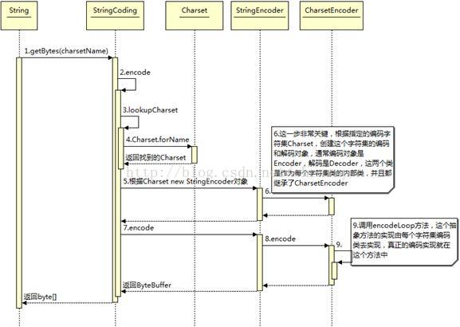

# Java 的编码和解码

## 一、编码和解码

在上篇博客中主要阐述了三个渠道的编码转换过程，下面将介绍 java 在哪些场合需要进行编码和解码操作，并详序中间的过程，进一步掌握 java 的编码和解码过程。在 java 中主要有四个场景需要进行编码解码操作：

1：I/O操作

2：内存

3：数据库

4：javaWeb

下面主要介绍前面两种场景，数据库部分只要设置正确编码格式就不会有什么问题，javaWeb 场景过多需要了解URL、get、POST的编码，servlet 的解码，所以 javaWeb 场景下节介绍。

### 1. I/O操作

在前面就提过乱码问题无非就是转码过程中编码格式的不统一产生的，比如编码时采用UTF-8，解码采用GBK，但最根本的原因是字符到字节或者字节到字符的转换出问题了，而这中情况的转换最主要的场景就是I/O操作的时候。当然I/O操作主要包括网络I/O（也就是javaWeb）和磁盘I/O。网络I/O下节介绍。

首先我们先看I/O的编码操作。

InputStream 为字节输入流的所有类的超类，Reader 为读取字符流的抽象类。java 读取文件的方式分为按字节流读取和按字符流读取，其中InputStream、Reader是这两种读取方式的超类。

**按字节**

我们一般都是使用InputStream.read()方法在数据流中读取字节（read()每次都只读取一个字节，效率非常慢，我们一般都是使用read(byte[])），然后保存在一个byte[]数组中，最后转换为String。在我们读取文件时，读取字节的编码取决于文件所使用的编码格式，而在转换为String过程中也会涉及到编码的问题，如果两者之间的编码格式不同可能会出现问题。

例如存在一个问题test.txt编码格式为UTF-8，那么通过字节流读取文件时所获得的数据流编码格式就是UTF-8，而我们在转化成String过程中如果不指定编码格式，则默认使用系统编码格式（GBK）来解码操作，由于两者编码格式不一致，那么在构造String过程肯定会产生乱码，如下：

~~~java
File file = new File("C:\\test.txt");
InputStream input = new FileInputStream(file);
StringBuffer buffer = new StringBuffer();
byte[] bytes = new byte[1024];
for(int n; (n = input.read(bytes)) != -1; ){
    buffer.append(new String(bytes,0,n));
}
System.out.println(buffer);
~~~

输出结果：锘挎垜鏄?cm

test.txt中的内容为：我是 cm。

解决办法就是在构造字符串的时候指定编码格式：

~~~java
buffer.append(new String(bytes, 0, n, "UTF-8"));
~~~

**按字符**

其实字符流可以看做是一种包装流，它的底层还是采用字节流来读取字节，然后它使用指定的编码方式将读取字节解码为字符。在java中Reader是读取字符流的超类。所以从底层上来看按字节读取文件和按字符读取没什么区别。在读取的时候字符读取每次是读取若干个字节，字节流每次读取一个字节。

**字节&字符转换**

字节转换为字符一定少不了InputStreamReader。API解释如下：InputStreamReader 是字节流通向字符流的桥梁：它使用指定的 charset 读取字节并将其解码为字符。它使用的字符集可以由名称指定或显式给定，或者可以接受平台默认的字符集。 每次调用 InputStreamReader 中的一个 read() 方法都会导致从底层输入流读取一个或多个字节。要启用从字节到字符的有效转换，可以提前从底层流读取更多的字节，使其超过满足当前读取操作所需的字节。API解释非常清楚，InputStreamReader在底层读取文件时仍然采用字节读取，读取字节后它需要根据一个指定的编码格式来解析为字符，如果没有指定编码格式则采用系统默认编码格式。

~~~java
String file = "C:\\test.txt"; 
String charset = "UTF-8"; 
// 写字符换转成字节流
FileOutputStream outputStream = new FileOutputStream(file); 
OutputStreamWriter writer = new OutputStreamWriter(outputStream, charset); 
try { 
    writer.write("我是 cm"); 
} finally { 
    writer.close(); 
} 

// 读取字节转换成字符
FileInputStream inputStream = new FileInputStream(file); 
InputStreamReader reader = new InputStreamReader( 
    inputStream, charset); 
StringBuffer buffer = new StringBuffer(); 
char[] buf = new char[64]; 
int count = 0; 
try { 
    while ((count = reader.read(buf)) != -1) { 
        buffer.append(buf, 0, count); 
    } 
} finally { 
    reader.close(); 
}
System.out.println(buffer);
~~~

### 2. 内存

先举一个简单的例子：

~~~java
String s = "我是 cm"; 
byte[] bytes = s.getBytes(); 
String s1 = new String(bytes,"GBK"); 
String s2 = new String(bytes);
~~~

在这段代码中我们看到了三处编码转换过程（一次编码，两次解码）。

首先编码的过程，先看 String.getTytes()：

~~~java
public byte[] getBytes() {
    return StringCoding.encode(value, 0, value.length);
}
~~~

内部调用 encode（）方法：

~~~java
static byte[] encode(char[] ca, int off, int len) {
    String csn = Charset.defaultCharset().name();
    try {
        // use charset name encode() variant which provides caching.
        return encode(csn, ca, off, len);
    } catch (UnsupportedEncodingException x) {
        warnUnsupportedCharset(csn);
    }
    try {
        return encode("ISO-8859-1", ca, off, len);
    } catch (UnsupportedEncodingException x) {
        // If this code is hit during VM initialization, MessageUtils is
        // the only way we will be able to get any kind of error message.
        MessageUtils.err("ISO-8859-1 charset not available: "
                         + x.toString());
        // If we can not find ISO-8859-1 (a required encoding) then things
        // are seriously wrong with the installation.
        System.exit(1);
        return null;
    }
}
~~~

可以看到 encode（）方法首先会调用系统默认的编码格式，如果未指定则默认使用ISO-8859-1编码格式进行编码操作，进一步深入如下：

~~~java
String csn = (charsetName == null) ? "ISO-8859-1" : charsetName;
~~~

同样的方法可以看到new String 的构造函数内部是调用StringCoding.decode()方法：

~~~java
public String(byte bytes[], int offset, int length, Charset charset) {
    if (charset == null)
        throw new NullPointerException("charset");
    checkBounds(bytes, offset, length);
    this.value =  StringCoding.decode(charset, bytes, offset, length);
}
~~~

decode方法和encode对编码格式的处理是一样的。

对于以上两种情况我们只需要设置统一的编码格式一般都不会产生乱码问题。

## 二、编码和编码格式

Java 编码类图：

首先根据指定的chart设置ChartSet类，然后根据ChartSet创建ChartSetEncoder对象，最后再调用 CharsetEncoder.encode 对字符串进行编码，不同的编码类型都会对应到一个类中，实际的编码过程是在这些类中完成的。下面时序图展示详细的编码过程：

通过这编码的类图和时序图可以了解编码的详细过程。下面将通过一段简单的代码对ISO-8859-1、GBK、UTF-8编码：

~~~java
public class Test02 {
    public static void main(String[] args) throws UnsupportedEncodingException {
        String string = "我是 cm";
        Test02.printChart(string.toCharArray());
        Test02.printChart(string.getBytes("ISO-8859-1"));
        Test02.printChart(string.getBytes("GBK"));
        Test02.printChart(string.getBytes("UTF-8"));
    }
    
    /**
     * char转换为16进制
     */
    public static void printChart(char[] chars){
        for(int i = 0 ; i < chars.length ; i++){
            System.out.print(Integer.toHexString(chars[i]) + " "); 
        }
        System.out.println("");
    }
    
    /**
     * byte转换为16进制
     */
    public static void printChart(byte[] bytes){
        for(int i = 0 ; i < bytes.length ; i++){
            String hex = Integer.toHexString(bytes[i] & 0xFF); 
             if (hex.length() == 1) { 
               hex = '0' + hex; 
             } 
             System.out.print(hex.toUpperCase() + " "); 
        }
        System.out.println("");
    }
}
-------------------------outPut:
6211 662f 20 63 6d 
3F 3F 20 63 6D 
CE D2 CA C7 20 63 6D 
E6 88 91 E6 98 AF 20 63 6D
~~~

关系如图：

