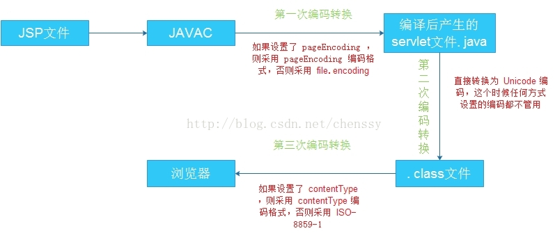

# JSP 页面编码过程

> 当一个JSP页面编写完成后需要将该页面发布到相应的服务器例如tomcat上，整个发布过程由包括两个小的步骤，一、将JSP翻译成Servlet（一个Java文件）。二、JSP引擎（tomcat）调用Java编译器将Servlet编译成.class文件并保存到规定的目录中。三、当用户在地址栏输入相应JSP页面的地址时，JSP引擎调用Java虚拟机来解释执行.class文件，并生成向客户端的回应信息。

我们知道JSP页面是需要转换为servlet的，在转换过程中肯定是要进行编码的。在JSP转换为servlet过程中下面一段代码起到至关重要的作用。

~~~jsp
<%@ page language="java" contentType="text/html; charset=UTF-8" pageEncoding="UTF-8" %>
~~~

在上面代码中有两个地方存在编码：pageEncoding、contentType的charset。**其中pageEncoding是jsp文件本身的编码**，而**contentType的charset是指服务器发送给客户端时的内容编码**。

jsp 在转换为 Servlet 的过程中是需要经过主要的三次编码转换过程（除去数据库编码转换、页面参数输入编码转换）：

第一次：转换为.java文件；

第二次：转换为.class文件；

第三次：业务逻辑处理后输出。

**第一阶段**

JVM 将 JSP 编译为 .java 文件。在这个过程中pageEncoding就起到作用了，JVM首先会获取pageEncoding的值，如果该值存在则采用它设定的编码来编译，否则则采用file.encoding编码来编译。

**第二阶段**

JVM将.java文件转换为.class文件。在这个过程就与任何编码的设置都没有关系了，不管JSP采用了什么样的编码格式都将无效。经过这个阶段后.jsp文件就转换成了统一的Unicode格式的.class文件了。

**第三阶段**

后台经过业务逻辑处理后将产生的结果输出到客户端。在这个过程中contentType的charset就发挥了功效。如果设置了charset则浏览器就会使用指定的编码格式进行解码，否则采用默认的ISO-8859-1编码格式进行解码处理。

流程：

