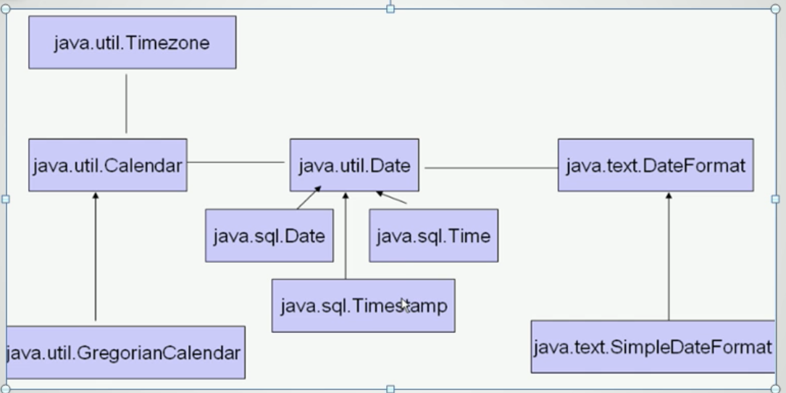

# Java中的时间类

## 1. 相关类的关系图

## 2. 相关类的使用

#### 2.1 java.util.Date

该类当前已经不被推荐使用，但是对于一些简单的操作还是比较方便的，比如获取当前时间等。

~~~java
import java.util.Date;

public class TimeTest {
	public static void main(String[] args) {
		//创建一个当前的时间类对象
		Date now = new Date();
		
		//获取当前的时间
		System.out.println(now.toString());     //一般的格式
		System.out.println(now.toLocaleString());  //本地的日期格式
		
		//返回从1970年1月1日0时0分0秒到当前时间的毫秒数(注意是格林尼治时间)
		System.out.println(now.getTime());		
	}
}
/*
Sun Jul 14 00:27:51 CST 2019
2019-7-14 0:27:51
1563035271584
*/
~~~

> 该时间类内部有一个 fastTime 用于保存该时间所对应的毫秒数

#### 2.2 java.sql.Date和java.sql.Time

java.sql.Date 和 java.sql.Time 是 java.util.Date 的子类，java.sql.Date 只显示时间的年月日部分； java.sql.Time 只显示时间的时分秒部分

**1、创建对象**

* 通过构造方法，传入一个毫秒数

  注意：该构造方法直接调用父类的构造方法

* 使用相应类的 valueOf（）静态方法，传入一个指定格式的字符串

**2、与 java.util.Date 的转换**

先转化为毫秒数，再创建相应类型的对象。

**3、实例**

~~~java
import java.sql.Date;
import java.sql.Time;

public class TimeTest {
	public static void main(String[] args) {
		//方法一：
		//创建sql.Date对象，注意该对象没有空的构造方法，需要传入一个毫秒数
		Date now = new Date(System.currentTimeMillis());
		System.out.println("now: " + now);           //now: 2019-07-15
		
		//方法二：
		Date now1 = Date.valueOf("2019-7-15");
		System.out.println("now1: " + now1);        //now1: 2019-07-15
		
		Time time = new Time(System.currentTimeMillis());
		System.out.println(time);       //16:20:23
		
		//java.sql.Date 和 java.util.Date 的相互转化
		java.util.Date uDate = new java.util.Date(now.getTime());
		System.out.println(uDate.toLocaleString());   //2019-7-15 16:20:23
		
		//java.util.Date 转 java.sql.Date 的方法类似 
	}
}
~~~

#### 2.3 SimpleDateFormat 时间类型的字符串和字符串对象之间的转化

两个操作：

* 将一个表示时间的字符串按照相应的格式转换为一个时间类对象
* 将一个时间类对象按照指定的格式转化为一个字符串

~~~java
import java.text.ParseException;
import java.text.SimpleDateFormat;
import java.util.Date;

public class TestDateFoemat {
	public static void main(String[] args) {
		String str = "2017年7月15日";
		SimpleDateFormat sdf = new SimpleDateFormat("yyyy年MM月dd日");
		
		Date date = null;
		try {
            //解析字符串
			date = sdf.parse(str);
		} catch (ParseException e) {
			e.printStackTrace();
		}
		System.out.println(date);        //Sat Jul 15 00:00:00 CST 2017
		
        //格式化时间
		String str1 = sdf.format(date);
		System.out.println(str1);       //2017年07月15日
	}
}
~~~

#### 2.4 Calendar 类

是一个时间类吗，用来替代过时的Date类，功能强大，但是并不是非常实用。

