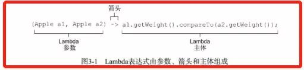

# Java8之熟透Lambda表达式 

## 一、Lambda简述

#### 1.1、Lambda概述

 **Lambda 表达式**可以理解为简洁地表示可传递的匿名函数的一种方式：它没有名称，但它有参数列表、函数主体、返回类型，可能还有一个可以抛出的异常列表。

- **匿名**：它不像普通方法那样有一个明确的名称；
- **函数**：Lambda 表达式是函数是因为它不像方法那样属于某个特定的类，但和方法一样，Lambda 有参数列表、函数主体、返回类型，还可能有可以抛出的异常列表；
- **传递**：Lambda 表达式可以作为参数传递给方法或存储在变量中；
- **简洁**：无需像匿名类那样写很多模板代码；

So That:

- lambada 表达式实质上是一个匿名方法，但该方法并非独立执行，而是用于**实现由函数式接口定义的唯一抽象方法**
- 使用 lambda 表达式时，会创建实现了函数式接口的一个匿名类实例
- 可以将 lambda 表达式视为一个对象，可以将其作为参数传递

#### 1.2、Lambda简介

Lambda 表达式是一个**匿名函数**（对于 Java 而言并不很准确，但这里我们不纠结这个问题）。简单来说，这是一种**没有声明的方法，即没有访问修饰符，返回值声明和名称**。

Java 中的 Lambda 表达式通常使用语法是 `(argument) -> (body)`:

```java
(arg1, arg2...) -> { body }
(type1 arg1, type2 arg2...) -> { body }
```

Lambda 表达式举例:

```java
(int a, int b) -> {  return a + b; }
() -> System.out.println("Hello World");
(String s) -> { System.out.println(s); }
() -> 42
() -> { return 3.1415 };
```

#### 1.3、Lambda表达式组成与结构

##### 1.3.1、Lambda表达式组成

Lambda 表达式由参数列表、箭头和 Lambda 主体组成。

```java
(Apple o1, Apple o2) -> Integer.valueOf(o1.getWeight()).compareTo(Integer.valueOf(o2.getWeight()))
```

1. **参数列表：**这里采用了 Comparator 中 compareTo 方法的参数；
2. **箭头：**箭头把参数列表和 Lambda 主体分开；
3. **Lambda 主体：**表达式就是 Lambda 的返回值；

##### 1.3.2、Lambda表达式结构

**1）Lambda 表达式的结构**

- Lambda 表达式可以具有零个，一个或多个参数。
- 可以显式声明参数的类型，也可以由编译器自动从上下文推断参数的类型。例如 `(int a)` 与刚才相同 `(a)`。
- 参数用小括号括起来，用逗号分隔。例如 `(a, b)` 或 `(int a, int b)` 或 `(String a, int b, float c)`。
- 空括号用于表示一组空的参数。例如 `() -> 42`。
- 当有且仅有一个参数时，如果不显式指明类型，则不必使用小括号。例如 `a -> return a*a`。
- Lambda 表达式的正文可以包含零条，一条或多条语句。
- 如果 Lambda 表达式的正文只有一条语句，则大括号可不用写，且表达式的返回值类型要与匿名函数的返回类型相同。
- 如果 Lambda 表达式的正文有一条以上的语句必须包含在大括号（代码块）中，且表达式的返回值类型要与匿名函数的返回类型相同。

**2）有效Lambda 表达式举例**

| Lambda 表达式                                                | 含义                                                         |
| ------------------------------------------------------------ | ------------------------------------------------------------ |
| `(String s) -> s.length()`                                   | 表达式具有一个 String 类型的参数并返回一个 int。Lambda 没有 return 语句，因为已经隐含的 return，可以显示调用 return。 |
| `(Apple a) -> a.getWeight() > 150`                           | 表达式有一个 Apple 类型的参数并返回一个 boolean 值           |
| `(int x, int y) ->` `{ System.out.printn("Result");` `System.out.printn(x + y)}` | 表达式具有两个 int 类型的参数而没有返回值（void返回），**Lambda 表达式可以包含多行语句，但必须要使用大括号包起来。** |
| `() -> 42`                                                   | 表达式没有参数，返回一个 int 类型的值。                      |
| `(Apple o1, Apple o2) ->` `Integer.valueOf(o1.getWeight())` `.compareTo` `(Integer.valueOf(o2.getWeight()))` | 表达式具有两个 Apple 类型的参数，返回一个 int 比较重要。     |

**3）Lambda 表达式的使用举例**

| 使用案例              | Lambda 示例                                                  |
| --------------------- | ------------------------------------------------------------ |
| 布尔表达式            | `(List<String> list) -> list.isEmpty()`                      |
| 创建对象              | `() -> new Apple(10)`                                        |
| 消费对象              | `(Apple a) -> { System.out.println(a.getWeight) }`           |
| 从一个对象中选择/抽取 | `(String s) -> s.lenght()`                                   |
| 组合两个值            | `(int a, int b) -> a * b`                                    |
| 比较两个对象          | ``(Apple o1, Apple o2) ->` `Integer.valueOf(o1.getWeight())` `.compareTo(Integer.valueOf(o2.getWeight()))` |

## 二、使用Lambda表达式

#### 2.1、函数式接口

**函数式接口**就是**只定义一个抽象方法**的接口，比如 Java API 中的 Predicate、Comparator 和 Runnable 等。

```java
public interface Predicate<T> {
	boolean test(T t);
}
public interface Comparator<T> {
	int compare(T o1, T o2);
}
public interface Runnable {
	void run();
}
```

**函数式接口作用是什么？**

Lambda 表达式允许你直接以内联的形式为函数式接口的抽象方法提供实现，并把整个表达式作为函数式接口的实例（具体说来，是函数式接口一个具体实现的实例）。你用匿名内部类也可以完成同样的事情，只不过比较笨拙：需要提供一个实现，然后 再直接内联将它实例化。

下面的代码是有效的，因为Runnable是一个只定义了一个抽象方法run 的函数式接口：

```java
//使用Lambda
Runnable r1 = () -> System.out.println("Hello World 1");

//匿名类
Runnable r2 = new Runnable(){ 
	public void run(){ 
        System.out.println("Hello World 2"); 
    } 
};

public static void process(Runnable r){ 
    r.run(); 
}

process(r1); //打印 "Hello World 1"
process(r2); //打印 "Hello World 2"

//利用直接传递的 Lambda 打印 "Hello World 3"
process(() -> System.out.println("Hello World 3"));
```

#### 2.2、通过示例感受Lambda

1）之前做法

```java
Comparator<Apple> byWeight = new Comparator<Apple>() {
    public int compare(Apple a1, Apple a2){
        return a1.getWeight().compareTo(a2.getWeight());
    }
};
```

2）现在做法

```java
Comparator<Apple> byWeight =
(Apple a1, Apple a2) -> a1.getWeight().compareTo(a2.getWeight());
```

3）再通过一个明显的实例

```java
public static void rawUseMethod(){
    List<String> names = Arrays.asList("peter", "anna", "mike", "xenia");

    Collections.sort(names, new Comparator<String>() {
        @Override
        public int compare(String a, String b) {
            return a.compareTo(b);
        }
    });

    for (String str : names){
        System.out.println(str);
    }
}

public static void useLambda1(){
    List<String> names = Arrays.asList("peter", "anna", "mike", "xenia");
    Collections.sort(names,(String a,String b) -> {
        return a.compareTo(b);
    });
    
    for (String str : names){
        System.out.println(str);
    }
}

public static void useLambda2(){
    List<String> names = Arrays.asList("peter", "anna", "mike", "xenia");
    Collections.sort(names,(String a,String b) -> a.compareTo(b));
    
    for (String str : names){
        System.out.println(str);
    }
}

public static void useLambda3(){
    List<String> names = Arrays.asList("peter", "anna", "mike", "xenia");
    names.sort((String a,String b) -> a.compareTo(b));
    
    //当然也可以直接去掉参数类型，直接推导出来即可
    names.sort((a,b) -> a.compareTo(b));
    for (String str : names){
        System.out.println(str);
    }
}
```

#### 2.3、Lambda语法规则


**Lambda表达式有三个部分：**
1）参数列表
这里它采用了Comparator中compare方法的参数，两个Apple。
2）箭头
箭头->把参数列表与Lambda主体分隔开。
3）Lambda主体
比较两个Apple的重量。表达式就是Lambda的返回值了。

为了进一步说明，下面给出了Java 8中五个有效的Lambda表达式的例子。

| 布尔表达式 | (List list) -> list.isEmpty() |
| --------------------- | ------------------------------------------------------------ |
| 创建对象 | () -> new Apple(10) |
| 消费一个对象 | (Apple a) -> { System.out.println(a.getWeight()); } |
| 从一个对象中选择/抽取 | (String s) -> s.length() |
| 组合两个值 | (int a, int b) -> a * b |
| 比较两个对象 | (Apple a1, Apple a2) -> a1.getWeight().compareTo(a2.getWeight()) |

## 三、Functional接口（函数式接口）

#### 3.1、概述

"函数式接口"是指仅仅**只包含一个抽象方法**的接口,每一个函数式接口类型的 lambda 表达式都会自动匹配到这个抽象方法。因为默认方法不算抽象方法,所以你也可以给你的函数式接口添加默认方法。

我们可以将lambda表达式当作任意只包含一个抽象方法的接口类型,为了确保你的接口确实是达到这个要求的,可以接口上添加 @FunctionalInterface 注解,编译器如果发现你标注了这个注解的接口有多于一个抽象方法的时候会报错的。

#### 3.2、举例说明

1）定义函数式接口

```java
//这个注解不加也可以,加上只是为了让编译器检查
@FunctionalInterface
interface Action{
    public void run();

    default void doSomething(){
    	System.out.println("doSomething..");
    }
}
//这个注解不加也可以,加上只是为了让编译器检查
@FunctionalInterface
interface Work<T,V>{
    public V doWork(T t);
}
```

2）使用

```java
public class LambdaTest2 {
    public static void main(String[] args) {
                
        //原来的内部类实现方式
        test(new Action(){
            @Override
            public void run() {
                System.out.println("run..");
            }
        });
                    
        //lambda表达式方法
        test(()->System.out.println("run"));
        
        //也可以先创建对象
        Action a = ()->System.out.println("run...");
        System.out.println(a.getClass());
        test(a);
        
        //接口中有泛型也可以,只关注方法的参数和返回值
        Work<String,Integer> w = (v)->v.length();
        run(w);

        run((v)->v.length());
        
        //如果参数只有一个,那么还可以这样简写: 去掉小括号
        //注意代码就一句,作为返回值的话不用写return
        run(v->v.length());
                    
        //有多句代码,就需要写{}了,并且需要写return
        run(v->{
            System.out.println("doWork..");
            return v.length();
        });
        
        //观察下面代码是什么意思
        run(v->1);
                    
    }
        
    public static void test(Action a){
        a.run();
        a.doSomething();
    }
            
    public static void run(Work<String,Integer> a){
        int i = a.doWork("hello");
        System.out.println(i);
    }     
}
```

**注意：**

lambda表达式无法访问接口的默认方法，lambda 表达式只能去匹配对应接口中的唯一抽象方法。

相当于lambda表达式只是对抽象方法的实现,并没有创建接口的实现类对象,因为我们只是想使用这个抽象方法的实现。

