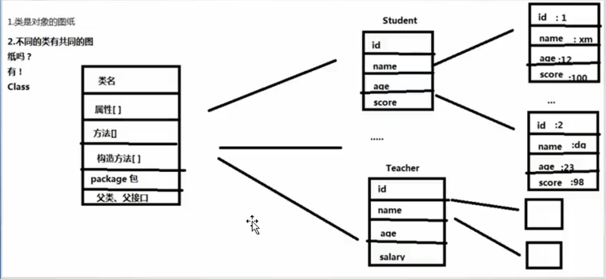

# 反射

## 1.反射的引入

**1. 出现的原因**

如果在编码的过程中还不知道要具体实例化的对象，则可以通过反射技术实现动态编码。

## 2. 反射的原理

**1. Class类**

Class类是java反射机制的起源和入口，是所有类的共同图纸。可以将每个类也看作是一个对象，有共同的图纸Class，存放类的结构信息，能够通过相应的方法获取相应的信息。

> * 用于获取各种与类相关的信息
> * 提供了获取类信息的方法
> * 继承自Object类

**图解Class类：**

**2. 获取Class的类信息**

~~~java
package Test;

import java.lang.reflect.Constructor;
import java.lang.reflect.Field;
import java.lang.reflect.Method;

/*
 * 单纯的得到类对象的信息不属于反射，使用得到的信息Field，Method，Constructor执行相应的操作才属于反射
 */

public class Main{
	public static void main(String[] args) throws Exception {
		String className = "Test.Cat";
		
		//获取类对象，方法1
		Class clazz = Class.forName(className);
		
		//获取类对象，方法2
		Class clazz1 = Cat.class;
		
		//获取类对象，方法3
		Class clazz2 = new Cat().getClass();
		
		//实例化
		Object obj = clazz.newInstance();
		
		//获取类对象的基本信息
		clazz.getName();           //获取类的全名
		clazz.getPackage();        //包名
		clazz.getSimpleName();     //简单的类名
		
		//获取类对象的属性信息
		/*所有属性*/
		Field[] fields = clazz.getFields();        //获得当前类及其父类的共有属性		
		Field[] fields2 = clazz.getDeclaredFields();  //只能获得当前类的所有（任何权限的）属性（不包括父类）
		
		/*指定属性*/
		Field field = clazz.getField("length");       //指定的共有属性
		System.out.println(field);
		
		Field field2 = clazz.getDeclaredField("age");  //指定的属性
		System.out.println(field2);
		
		//获取类对象的方法信息
		/*所有的方法*/
		Method[] methods = clazz.getMethods();       //本类及其父类的公有方法
		Method[] methods2 = clazz.getDeclaredMethods();     //本类的所有方法
		
		/*获得指定的方法*/
		/*
		 * 参数为方法名和该方法参数的类信息
		 */
		Method method = clazz.getMethod("className", String.class, int.class, double.class);
		Method method2 = clazz.getDeclaredMethod("className", String.class, int.class, double.class);
		
		/*获取类对象的构造方法的信息*/
		/*
		 * 解释同上
		 */
		Constructor[] constructors = clazz.getConstructors();
		Constructor[] constructors2 = clazz.getDeclaredConstructors();
		
		/*
		 * 只需要指定参数类型，不需要方法名
		 */
		Constructor constructor = clazz.getConstructor(String.class, int.class, double.class);
		Constructor constructor2 = clazz.getDeclaredConstructor(String.class, int.class);
 	}
}
~~~

**3. 创建对象**

~~~java
import java.lang.reflect.Constructor;

/*
 * 单纯的得到类对象的信息不属于反射，使用得到的信息Field，Method，Constructor执行相应的操作才属于反射
 */

public class Main{
	public static void main(String[] args) throws Exception {
		String className = "Test.Cat";
		
		//获得类对象
		Class clazz = Class.forName(className);
		
		//方法1：使用无参构造方法创建对象
		Object obj = clazz.newInstance();
		
		//方法2：使用无参构造方法创建对象
		Constructor constructor = clazz.getConstructor();
		Object obj1 = constructor.newInstance();
		
		//方法3：使用有参的构造方法创建对象
		Constructor constructor2 = clazz.getConstructor(int.class, String.class, int.class);
		Object obj2 = constructor2.newInstance(18, "blue", 12);
 	}
}
~~~

**4. 操作属性**

~~~java
public class Main{
	public static void main(String[] args) throws Exception {
		String className = "Test.Cat";
		
		//获得类对象
		Class clazz = Class.forName(className);
		
		//创建对象
		Object obj = clazz.newInstance();

		//得到属性
		Field field = clazz.getDeclaredField("age");

		//设置属性可操作
		field.setAccessible(true);
		
		//getter/setter操作
		field.set(obj, 100);
		System.out.println(field.get(obj));
 	}
}
~~~

**5. 执行方法**

~~~java
public class Main{
	public static void main(String[] args) throws Exception {
		String className = "Test.Cat";
		
		//获得类对象
		Class clazz = Class.forName(className);
		
		//创建对象
		Object obj = clazz.newInstance();

		//得到方法
		Method method = clazz.getMethod("add", int.class, int.class);

		//执行方法
        /*
        * obj 表示要执行该方法的对象
        * 10、20表示该方法的参数
        */
		int result = (int)method.invoke(obj, 10, 20);
		System.out.println(result);
 	}
}
~~~

