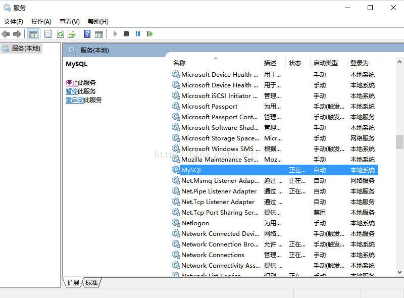
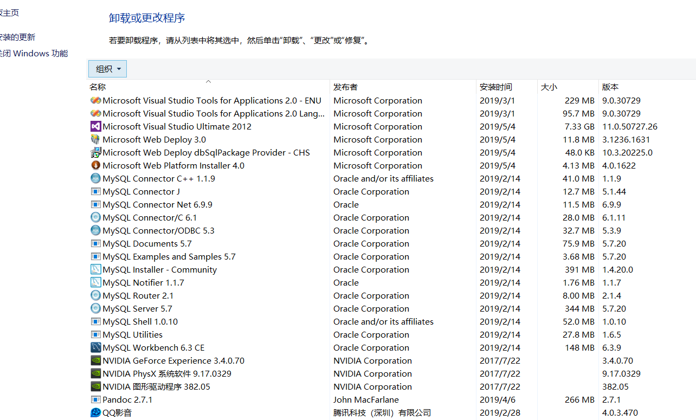
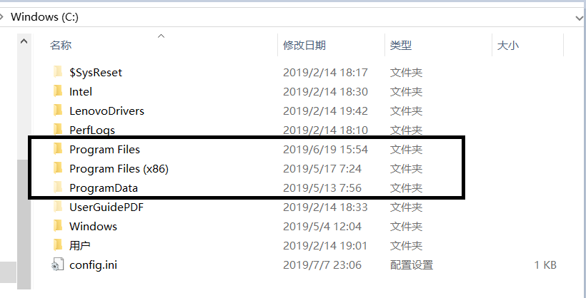

# win10下彻底卸载MySQL

**1. 停止服务**

启动cmd->输入services.msc->找到mySQL->停止SQL服务

**2. 卸载软件**

在控制面板将 MySQL 软件卸载，沾边的全部干掉

**3. 删除安装目录的文件**

即下图三个文件夹中对应的 MySQL 目录

**4. 删除C盘用户目录中APPData下的MySQL目录**

**5. 删除注册表信息**

运行“regedit”文件，打开注册表。
删除HKEY_LOCAL_MACHINE\SYSTEM\ControlSet001\Services\Eventlog\Application\MySQL文件夹
删除HKEY_LOCAL_MACHINE\SYSTEM\ControlSet002\Services\Eventlog\Application\MySQL文件夹。
删除HKEY_LOCAL_MACHINE\SYSTEM\CurrentControlSet\Services\Eventlog\Application\MySQL的文件夹。
如果没有相应的文件夹，就不用删除了。