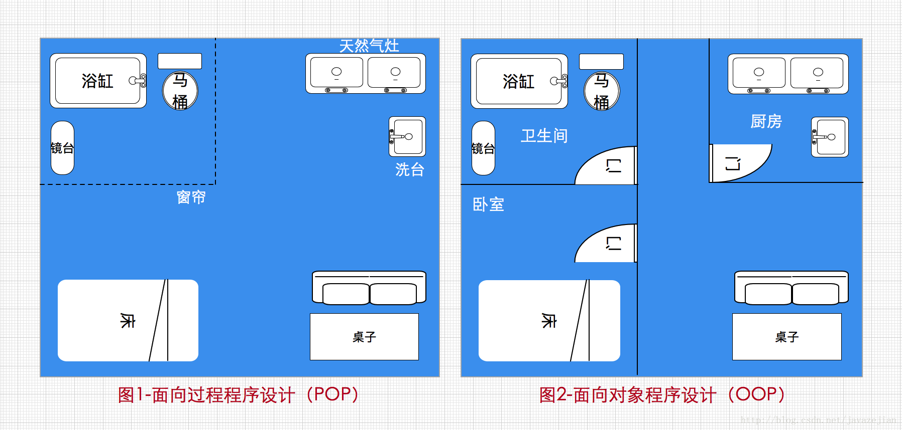
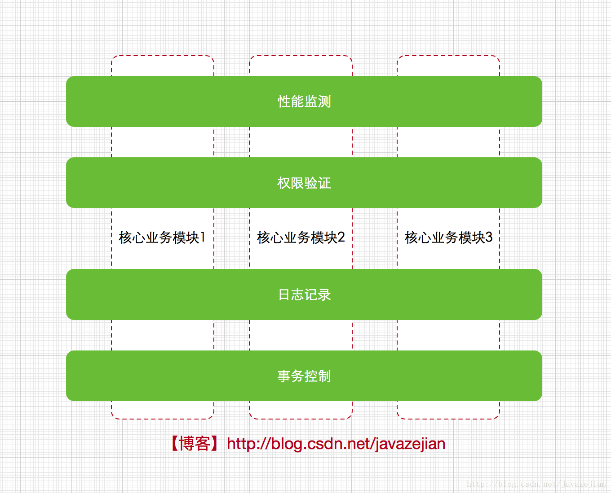
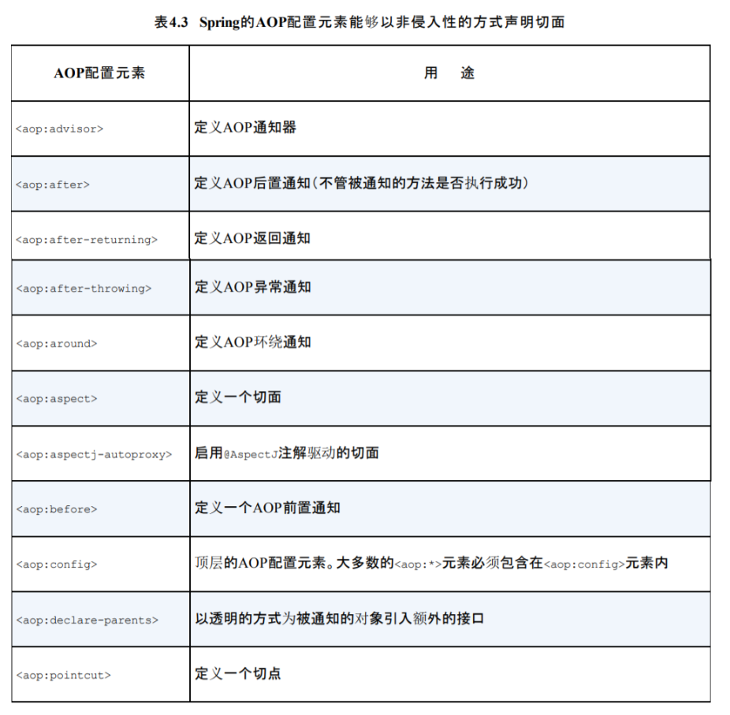

# Spring AOP

## 一、AOP 的引入

OOP 即面向对象的程序设计，谈起了 OOP，我们就不得不了解一下 POP 即面向过程程序设计，它是以功能为中心来进行思考和组织的一种编程方式，强调的是系统的数据被加工和处理的过程，说白了就是注重功能性的实现，效果达到就好了，而OOP则注重封装，强调整体性的概念，以对象为中心，将对象的内部组织与外部环境区分开来。

一张很贴切的图：



基于面向对象的思想，将事物进行抽象，封装为一个一个的对象，并且通过继承和多态也解决了一些代码冗余的问题。但随着软件规模的增大，应用的逐渐升级，慢慢地，OOP 也开始暴露出一些问题：

我们在实现我们的核心功能的时候总会掺杂着一些与核心业务无关的代码，例如日志记录，权限验证，事务控制，性能检测，错误信息检测等等，这些特殊业务可以说和核心业务没有根本上的关联而且核心业务也不关心它们，比如在用户管理模块中，该模块本身只关心与用户相关的业务信息处理，至于其他的业务完全可以不理会，我们看一个简单例子协助理解这个问题：

~~~java
/**
 * Created by zejian on 2017/2/15.
 * Blog : http://blog.csdn.net/javazejian [原文地址,请尊重原创]
 */
public interface IUserService {

    void saveUser();

    void deleteUser();

    void findAllUser();
}
//实现类
public class UserServiceImpl implements IUserService {

    //核心数据成员

    //日志操作对象

    //权限管理对象

    //事务控制对象

    @Override
    public void saveUser() {

        //权限验证(假设权限验证丢在这里)

        //事务控制

        //日志操作

        //进行Dao层操作
        userDao.saveUser();

    }

    @Override
    public void deleteUser() {

    }

    @Override
    public void findAllUser() {

    }
}
~~~

上述代码中我们注意到一些问题，权限，日志，事务都不是用户管理的核心业务，也就是说用户管理模块除了要处理自身的核心业务外，还需要处理权限，日志，事务等待这些杂七杂八的不相干业务的外围操作，而且这些外围操作同样会在其他业务模块中出现，这样就会造成如下问题

- 代码混乱：核心业务模块可能需要兼顾处理其他不相干的业务外围操作，这些外围操作可能会混乱核心操作的代码，而且当外围模块有重大修改时也会影响到核心模块，这显然是不合理的。

* 代码分散和冗余：同样的功能代码，在其他的模块几乎随处可见，导致代码分散并且冗余度高。

* 代码质量低扩展难：由于不太相关的业务代码混杂在一起，无法专注核心业务代码，当进行类似无关业务扩展时又会直接涉及到核心业务的代码，导致拓展性低。

显然前面分析的两种解决方案已束手无策了，那么该如何解决呢？事实上我们知道诸如日志，权限，事务，性能监测等业务几乎涉及到了所有的核心模块，如果把这些特殊的业务代码直接到核心业务模块的代码中就会造成上述的问题，而工程师更希望的是这些模块可以实现热插拔特性而且无需把外围的代码入侵到核心模块中，这样在日后的维护和扩展也将会有更佳的表现，假设现在我们把日志、权限、事务、性能监测等外围业务看作单独的关注点(也可以理解为单独的模块)，每个关注点都可以在需要它们的时刻及时被运用而且无需提前整合到核心模块中，这种形式相当下图：


从图可以看出，每个关注点与核心业务模块分离，作为单独的功能，横切几个核心业务模块，这样的做的好处是显而易见的，每份功能代码不再单独入侵到核心业务类的代码中，即核心模块只需关注自己相关的业务，当需要外围业务(日志，权限，性能监测、事务控制)时，这些外围业务会通过一种特殊的技术自动应用到核心模块中，这些关注点有个特殊的名称，叫做“横切关注点”，上图也很好的表现出这个概念，另外这种抽象级别的技术也叫AOP（面向切面编程），正如上图所展示的横切核心模块的整面，因此AOP的概念就出现了，而所谓的特殊技术也就面向切面编程的实现技术，AOP的实现技术有多种，其中与Java无缝对接的是一种称为AspectJ的技术。那么这种切面技术（AspectJ）是如何在Java中的应用呢？不必担心，也不必全面了解AspectJ，本篇博文也不会这样进行，对于AspectJ，我们只会进行简单的了解，从而为理解Spring中的AOP打下良好的基础(Spring AOP 与AspectJ 实现原理上并不完全一致，但功能上是相似的，这点后面会分析)，毕竟Spring中已实现AOP主要功能，开发中直接使用Spring中提供的AOP功能即可，除非我们想单独使用AspectJ的其他功能。这里还需要注意的是，AOP的出现确实解决外围业务代码与核心业务代码分离的问题，但它并不会替代OOP，如果说OOP的出现是把编码问题进行模块化，那么AOP就是把涉及到众多模块的某一类问题进行统一管理，因此在实际开发中AOP和OOP同时存在并不奇怪，后面将会慢慢体会带这点。

**AOP 通过在代理方法中调用通知，实现对原方法功能的扩充**

## 二、AOP 的相关概念

~~~java
public class Demo {
	public void demo() {
		System.out.println("我是切点");
	}
	public void demo1() {
		System.out.println("我是切点");
	}
	public void demo2() {
		System.out.println("我是切点");
	}
	public void demo3() {
		System.out.println("我是切点");
	}
	
	/**
	 * joinPoint(连接点)：可以被拦截的目标函数，例如上方的 demo、demo1 等
	 * pointcut(切入点)：指定的具体的被拦截的目标函数
	 * advice(通知)：在某个切入点 pointcut 上需要执行的操作，如日志记录，权限验证等
	 * Aspect(切面)：切点和切面组合而成，用于定义通知作用于哪些切面上
	 * Weaving(织入)：把切面的代码织入到目标函数的过程
	 */
}
~~~

**通知的种类：**

- 前置通知：before
- 后置通知：after
- 返回通知：after-running
- 环绕通知：around
- 异常通知：Throw

**执行顺序**

```java
try {
	//前置通知
	//环绕前
	
	//切点方法
	
	//环绕后
	//返回通知
} catch{
	//异常通知
} finally {
    //后置通知
}
```

## 三、AOP 的配置

### 3.1 使用 schema 的方式配置

**定义前置通知**

~~~java
public class MyBeforeAdvice implements MethodBeforeAdvice{

	/* (非 Javadoc)
	 * @param arg0 切点方法对象 Method 对象
	 * @param arg1 切点方法参数
	 * @param arg2 切点在哪个对象中
	 * @throws Throwable
	 */
	@Override
	public void before(Method arg0, Object[] arg1, Object arg2) throws Throwable {
		System.out.println("我是前置通知");		
	}
}
~~~

**定义后置返回通知**

~~~java
public class MyAfterAdvice implements AfterReturningAdvice{

	/* (非 Javadoc)
	 * @param arg0 切点方法返回值
	 * @param arg1 切点方法对象
	 * @param arg2 切点方法参数
	 * @param arg3 切点方法所在的类对象
	 * @throws Throwable
	 */
	@Override
	public void afterReturning(Object arg0, Method arg1, Object[] arg2, Object arg3) throws Throwable {
		System.out.println("我是返回通知");
	}
}
~~~

> 只有当切点方法正常执行的时候才会执行，如果切点方法发生异常，不会执行。

**配置 applicationcontext.xml 文件**

* 引入 aop 命名空间

* 配置通知类的

* 配置切面

* \* 通配符,匹配任意方法名,任意类名,任意一级包名

* 如果希望匹配任意方法参数     (..)

~~~xml
<?xml version="1.0" encoding="UTF-8"?> 
<beans xmlns="http://www.springframework.org/schema/beans"
		xmlns:xsi="http://www.w3.org/2001/XMLSchema-instance"
	    xmlns:aop="http://www.springframework.org/schema/aop" 
	    xsi:schemaLocation="http://www.springframework.org/schema/beans 
	    https://www.springframework.org/schema/beans/spring-beans.xsd
        http://www.springframework.org/schema/aop 
        https://www.springframework.org/schema/aop/spring-aop.xsd">
 
	<!-- 配置通知类对象,在切面中引入 -->
	<bean id="mybefore" class="com.zcx.advice.MyBeforeAdvice"></bean>
	<bean id="myafter" class="com.zcx.advice.MyAfterAdvice"></bean>
	
	<!-- 配置测试类对象 -->
	<bean id="demo" class="com.zcx.pojo.Demo"></bean>
	 
	<!-- 配置切面 -->
	<aop:config>
		<!-- 配置切点 -->
		<aop:pointcut expression="execution(* com.zcx.pojo.Demo.demo(..))" id="mypoint"></aop:pointcut>
		<!-- 通知 -->
		<aop:advisor advice-ref="mybefore" pointcut-ref="mypoint"/>
		<aop:advisor advice-ref="myafter" pointcut-ref="mypoint"/>
	</aop:config>
</beans>
~~~

**测试代码**

~~~java
public class Test {
	
	public static void main(String[] args) {
		ApplicationContext ac = new ClassPathXmlApplicationContext("applicationcontext.xml");
		Demo d = (Demo) ac.getBean("demo");
		d.demo();
	}
}
~~~

**定义异常通知**

* 新建一个类实现 throwsAdvice 接口
* 重写 afterThrowing 方法
* 该方法的参数类型与切点报的异常的类型有关，匹配规则与 try...catch{} 相同，只有当切点报异常的时候才会执行异常通知。

~~~java
public class MyThrow implements ThrowsAdvice{
 
    public void afterThrowing(Exception ex) throws Throwable {
        System.out.println("执行异常通过-schema-base 方式");
    }
}
~~~

配置：

~~~xml
<bean id="mythrow" class="com.advice.MyThrow"></bean>
 
<!-- 配置切面 -->
<aop:config>
    <!-- 配置切点 -->
    <aop:pointcut expression="execution(*com.test.Demo.demo1())" id="mypoint"/>
    <!-- 通知 -->
    <aop:advisor advice-ref="mythrow" pointcut-ref="mypoint" />
</aop:config>
 
<bean id="demo" class="com.test.Demo"></bean>
~~~

**定义环绕通知**

~~~java
public class MyRound implements MethodInterceptor{

	/* (非 Javadoc)
	 * @param arg0
	 * @return
	 * @throws Throwable
	 */
	@Override
	public Object invoke(MethodInvocation arg0) throws Throwable {
		System.out.println("环绕前");
		Object res = arg0.proceed();           //放行，调用切点方法
		System.out.println("环绕后");
		return res;
	}
}
~~~

> 配置环绕通知后，切点方法的执行由环绕通知进行调用，如果环绕通知不放行，则切点方法不会被执行。

~~~xml
<!-- 配置通知类对象,在切面中引入 -->
<bean id="mybefore" class="com.zcx.advice.MyBeforeAdvice"></bean>
<bean id="myafter" class="com.zcx.advice.MyAfterAdvice"></bean>
<bean id="myround" class="com.zcx.advice.MyRound"></bean>

<!-- 配置测试类对象 -->
<bean id="demo" class="com.zcx.pojo.Demo"></bean>

<!-- 配置切面 -->
<aop:config>
    <!-- 配置切点 -->
    <aop:pointcut expression="execution(* com.zcx.pojo.Demo.demo(..))" id="mypoint"></aop:pointcut>
    <!-- 通知 -->
    <aop:advisor advice-ref="myround" pointcut-ref="mypoint"/>
    <aop:advisor advice-ref="mybefore" pointcut-ref="mypoint"/>
    <aop:advisor advice-ref="myafter" pointcut-ref="mypoint"/>

</aop:config>
~~~

>  对于前后置通知和环绕通知的执行顺序：
>
> * 对于前置通知和环绕通知来说，谁配置在前边谁先执行
> * 对于后置通知和环绕通知来说，谁配置在后边谁先执行
>
> 当切点方法发生异常的时候不会执行环绕后。

**几种通知的执行过程：**

相当于以下代码：

~~~java
try {
	//前置通知
	//环绕前
	
	//切点方法
	
	//环绕后
	//返回通知
} catch{
	//异常通知
} finally {
    //后置通知
}
~~~

### 3.2 使用 AspectJ 的方式配置（不带参数）

**AOP 中的配置元素：**



**配置一个 Java 类作为切面**

~~~java
public class MyAspect {
	public void before() {
		System.out.println("我是前置通知");
	}
	public void after() {
		System.out.println("我是后置通知");
	}
	public void afterRunning() {
		System.out.println("我是返回通知");
	}
	public void round(ProceedingJoinPoint pjp) {
		System.out.println("我是环绕前");
		try {
			pjp.proceed();
		} catch (Throwable e) {
			e.printStackTrace();
		}
		System.out.println("我是环绕后");
	}
	public void myThrow() {
		System.out.println("我是异常通知");
	}
}
~~~

**applicationcontext.xml 配置文件中的配置**

~~~xml
<bean id="demo1" class="com.zcx.pojo.Demo"></bean>
<bean id="aBean" class="com.zcx.pojo.MyAspect"></bean>

<aop:config>
    <aop:aspect id="myaspect" ref="aBean">
        <aop:pointcut id="pointcut" expression="execution(* com.zcx.pojo.Demo.demo(..))"/>
        <aop:before method="before" pointcut-ref="pointcut"/>
        <aop:after method="after" pointcut-ref="pointcut"/>
        <aop:around pointcut-ref="pointcut" method="round"/>
        <aop:after-throwing method="myThrow" pointcut-ref="pointcut"/>
    </aop:aspect>
</aop:config>
~~~

> AspectJ 的配置方式一般用在无参数的时候，如果加上参数太过麻烦。

### 3.3 基于注解的配置方式

**配置切面**

~~~java
@Component
@Aspect
public class MyAspect {
	@Before("com.zcx.pojo.Demo.demo()")
	public void before() {
		System.out.println("我是前置通知");
	}
	@After("com.zcx.pojo.Demo.demo()")
	public void after() {
		System.out.println("我是后置通知");
	}
	@AfterReturning("com.zcx.pojo.Demo.demo()")
	public void afterRunning() {
		System.out.println("我是返回通知");
	}
	@Around("com.zcx.pojo.Demo.demo()")
	public void round(ProceedingJoinPoint pjp) {
		System.out.println("我是环绕前");
		try {
			pjp.proceed();
		} catch (Throwable e) {
			e.printStackTrace();
		}
		System.out.println("我是环绕后");
	}
	@AfterThrowing("com.zcx.pojo.Demo.demo()")
	public void myThrow() {
		System.out.println("我是异常通知");
	}
}
~~~

**配置实际的类**

~~~java
@Component
public class Demo {
	@Pointcut("execution(* com.zcx.pojo.Demo.demo())")
	public void demo() {
		System.out.println("我是切点");
	}
}
~~~

**配置 applicationcontext.xml  文件**

~~~xml
<?xml version="1.0" encoding="UTF-8"?> 
<beans xmlns="http://www.springframework.org/schema/beans"
		xmlns:xsi="http://www.w3.org/2001/XMLSchema-instance"
	    xmlns:aop="http://www.springframework.org/schema/aop" 
	    xmlns:context="http://www.springframework.org/schema/context"
	    xsi:schemaLocation="http://www.springframework.org/schema/beans 
	    https://www.springframework.org/schema/beans/spring-beans.xsd
        http://www.springframework.org/schema/aop 
        https://www.springframework.org/schema/aop/spring-aop.xsd
        http://www.springframework.org/schema/context
        https://www.springframework.org/schema/context/spring-context.xsd">

    <!-- 配置注解扫描 -->
    <context:component-scan base-package="com.zcx.pojo"></context:component-scan>
    <!-- 设置代理模式为 cglib -->
    <aop:aspectj-autoproxy proxy-target-class="true"></aop:aspectj-autoproxy>
</beans>
~~~

> 上述注解的解释：
>
> - @Component：在类上声明，相当于配置 Bean 标签
> - @Aspect：想当于配置切面
> - @Pointcut：相当于配置切点，内容和在 xml 中配置时一样
> - @Before：前置通知，内容为切点方法的全限定名
> - 其余通知同前置通知
>
> **注意：**
>
> 使用注解 @Component 配置后相当于配置 Bean 标签，要想要获得实例化对象，使用 getBean 时将对应类名的第一个字母小写即可

## 总结

Schema 的配置方式适用于有参数的时候，AspectJ 的配置方式适用于无参数的时候。

