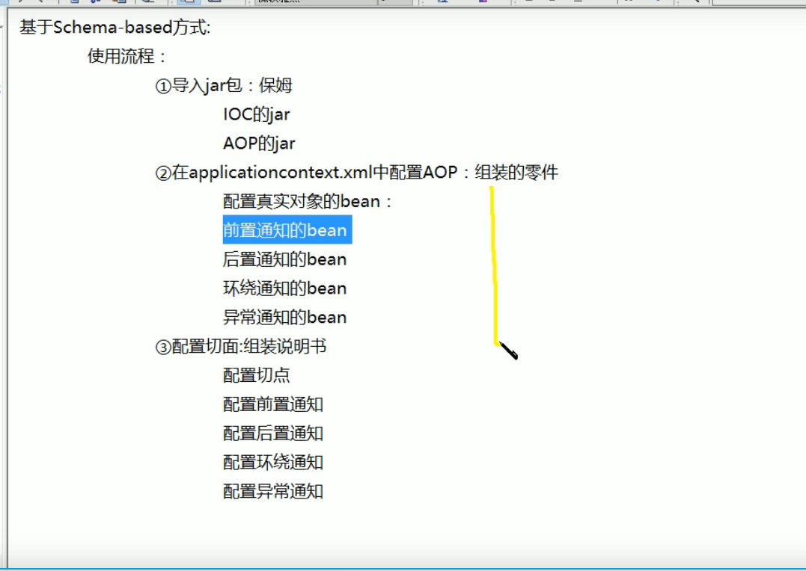
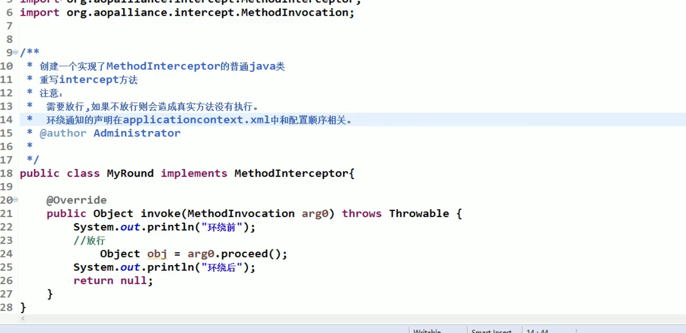
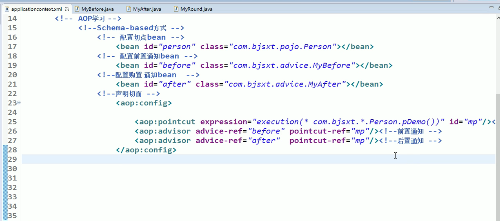
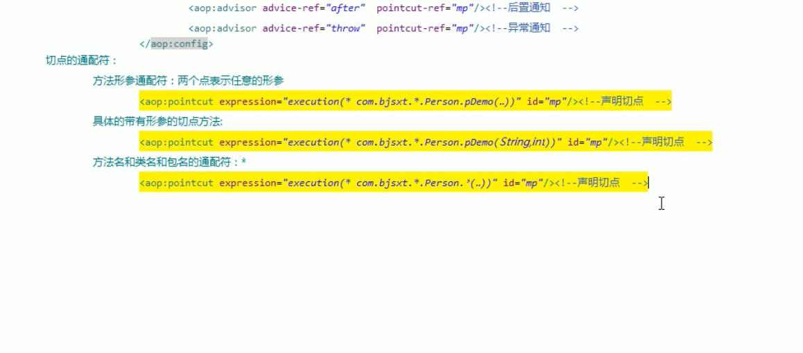
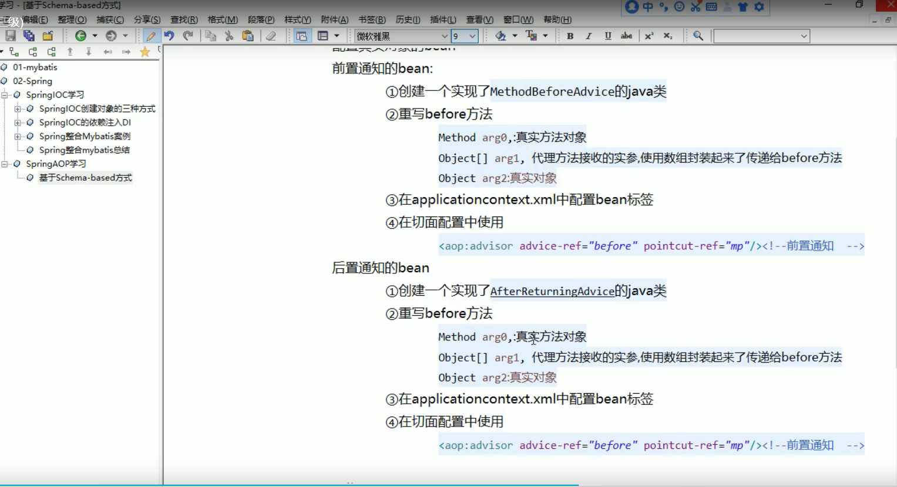
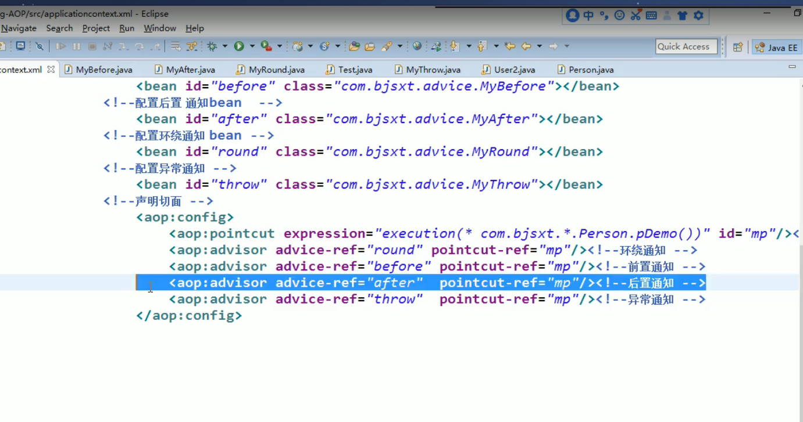
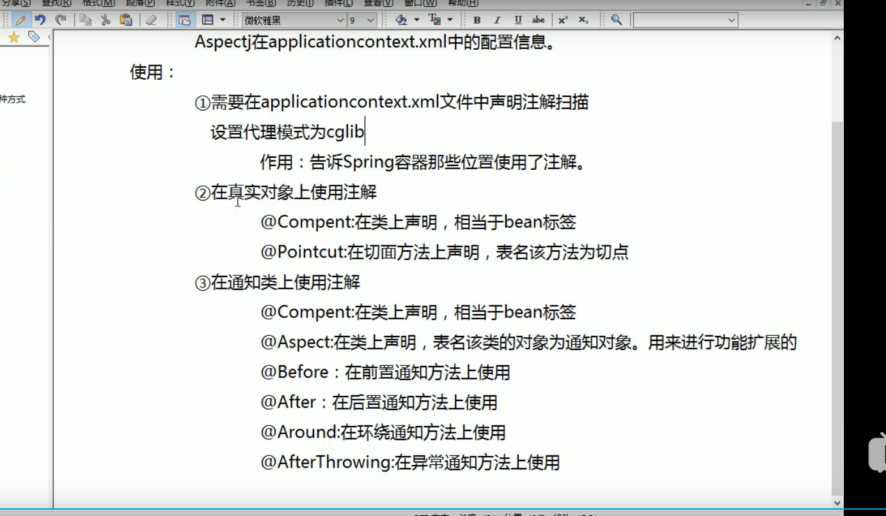

xml 配置文件的基本格式：

~~~xml
<?xml version="1.0" encoding="UTF-8"?>
<beans xmlns="http://www.springframework.org/schema/beans"
    xmlns:xsi="http://www.w3.org/2001/XMLSchema-instance"
    xsi:schemaLocation="http://www.springframework.org/schema/beans
        https://www.springframework.org/schema/beans/spring-beans.xsd">

    <!-- bean 标签 -->

</beans>
~~~

当 spring 容器读取配置文件的时候，会将配置文件中的对象全部进行创建（创建容器对象那一行代码的功能）

使用 springIOC 来创建对象，实现了责任链上层与层之间对象的解耦。便于随时对对象进行替换。

springAOP，不替换对象，对对象中的方法进行功能上的扩展，springAOP 是面向切面的编程

实现原理：使用一个接口，两个对象同时继承，在扩展的对象中调用被扩展的方法，并同时加入一些扩展的内容

切点：要进行功能扩展的方法。

前置通知：在切点执行之前执行的代码

后置通知：在切点执行之后执行的代码

切面：前置通知 + 后置通知 + 切点

织入：形成切面的过程

SpringAOP 动态生成扩展的对象，返回的其实是扩展的对象

配置 SpringAOP 的流程，创建前置通知对象，创建后置通知对象，配置 applicationcontext 文件。

两种配置方式：

- 基于 schema - base：

> 注意：配置顺序的测试

异常通知：当切点中抛出异常的时候调用。

13:23.08

该图片内容有问题，第二个

大佬：<https://blog.csdn.net/javazejian/article/details/56267036>

使用 AOP 之后调用的方法已经不是真是的方法，而是代理方法。

