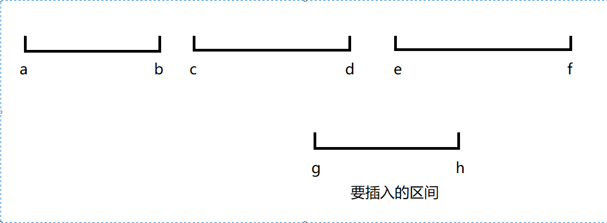

# 插入区间

[题目链接：](https://leetcode-cn.com/problems/insert-interval/)

**涉及知识：**二分查找，分类讨论

**分析：**

如下图所示：

题目中已经指出，所给区间根据起点进行从小到大的排序且无重叠，假设所要插入的区间为 [g, h]，实际上起点和终点均只有两种情况：1）在某一个区间的内部；2）在所给的两个区间之间；因此我们可以先通过二分查找的方法分别找到第一个起点小于等于 g 的区间和第一个起点小于等于 h 的区间。然后分类讨论：

* 如果起点 g 在某一个区间的内部，则将该区间和插入的区间合并，否则以插入区间的起点作为一个新区间的起点
* 如果终点 h 在某一个区间的内部，同样将该区间和插入区间进行合并，否则以插入区间的终点作为新区间的终点。
* 将新区间的起点之前和终点之后的区间复制到新的二维数组。

**Java 代码**

~~~java
import java.util.ArrayList;
import java.util.List;
/*
 * @lc app=leetcode.cn id=57 lang=java
 *
 * [57] 插入区间
 */
class Solution {
    private int[][] intervals = null;
    private List<Node> list = new ArrayList<Node>();

    public int[][] insert(int[][] intervals, int[] newInterval) {
        if(intervals.length == 0){
            int[][] res = {{newInterval[0], newInterval[1]}};
            return res;
        }

        this.intervals = intervals;
        int index1 = binarySearch(newInterval[0]);
        int index2 = binarySearch(newInterval[1]);

        int start = 0, end = 0;

        //判断目标区间与前一个区间的关系
        if(index1 == -1 || newInterval[0] > intervals[index1][1]){
            start = newInterval[0];
            index1++;
        } else if(intervals[index1][0] <= newInterval[0] && intervals[index1][1] >= newInterval[0]){              //与前边的区间合并
            start = intervals[index1][0];
        }
        
        //判断目标区间与后一个区间的关系
        if(index2 == -1 || intervals[index2][1] <= newInterval[1]){
            end = newInterval[1];
            index2++;
        } else if(intervals[index2][0] <= newInterval[1] && intervals[index2][1] >= newInterval[1]){              //与后边的区间合并
            end = intervals[index2][1];
            index2++;
        }

        //处理结果集
        for(int i = 0; i < index1; i++){
            list.add(new Node(intervals[i][0], intervals[i][1]));
        }
        list.add(new Node(start, end));
        for(int i = index2; i < intervals.length; i++){
            list.add(new Node(intervals[i][0], intervals[i][1]));
        }

        int[][] res = new int[list.size()][2];
        for(int i = 0; i < list.size(); ++i){
            res[i][0] = list.get(i).left;
            res[i][1] = list.get(i).right;
        }

        return res;

    }

    /**
     * 二分查找小于等于指定值的最大值
     * @param val 指定值
     * @return 目标区间的下标，-1 表示没有符合条件的区间
     */
    public int binarySearch(int val){
        int left = 0;
        int right = intervals.length - 1;
        int mid = 0;

        while(left < right){
            mid = left + (right - left + 1) / 2;

            if(intervals[mid][0] <= val){
                left = mid;
            } else {
                right = mid - 1;
            }
        }

        if(intervals[left][0] > val){
            return -1;
        }
        return left;
    }

    /**
     * 节点类，保存每一个区间
     */
    private class Node {
        public int left;
        public int right;

        public Node(int left, int right){
            this.left = left;
            this.right = right;
        }
    }
}
~~~

