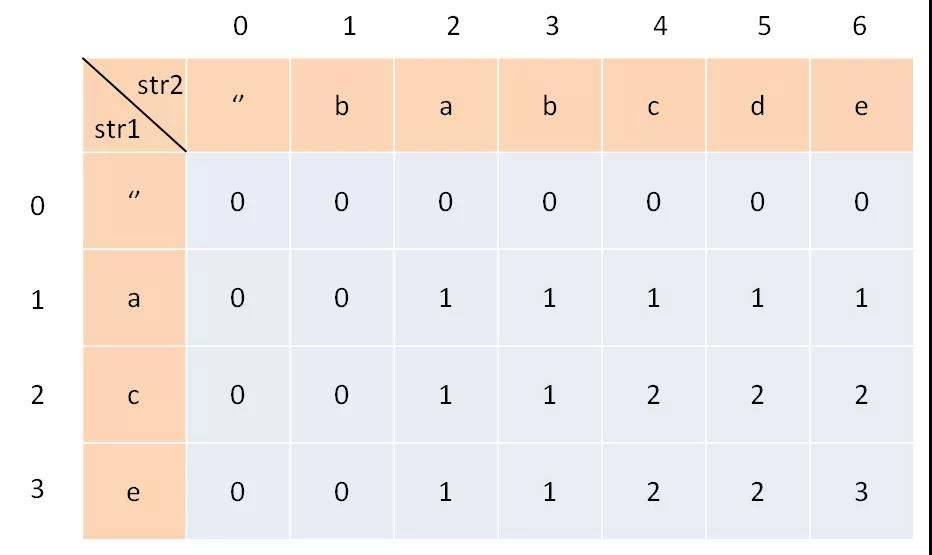

# 经典的动态规划问题

**目录：**

- [最长公共子序列](#最长公共子序列)
- [最长公共子串](#最长公共子串)
- [最大子序和](#最大子序和)
- [斐波那契数列](#斐波那契数列)

## 最长公共子序列

最长公共子序列（Longest Common Subsequence，简称 LCS）是一道非常经典的 dp 问题，它的解法是典型的二维动态规划，大部分比较困难的字符串问题都和这个问题一个套路，比如说编辑距离。而且，这个算法稍加改造就可以用于解决其他问题，所以说 LCS 算法是值得掌握的。 

肯定有读者会问，为啥这个问题就是动态规划来解决呢？因为子序列类型的问题，穷举出所有可能的结果都不容易，而**动态规划算法做的就是穷举 + 剪枝**，它俩天生一对儿。所以可以说只要涉及子序列问题，十有八九都需要动态规划来解决，往这方面考虑就对了。

---

**第一步，一定要明确dp数组的含义**。

对于两个字符串的动态规划问题，套路是通用的。比如说对于字符串s1和s2，一般来说都要构造一个这样的 DP table：



为了方便理解此表，我们暂时认为索引是从 1 开始的。其中，dp\[i]\[j] 的含义是：对于 s1[1..i] 和 s2[1..j]，它们的 LCS 长度是dp\[i]\[j]。

比如上图的例子，d\[2][4] 的含义就是：对于"ac"和"babc"，它们的 LCS 长度是 2。我们最终想得到的答案应该是dp\[3][6]。

**第二步，定义 base case。**

我们专门让索引为 0 的行和列表示空串，dp\[0][..]和dp\[..][0]都应该初始化为 0，这就是 base case。

**第三步，找状态转移方程。**

这是动态规划最难的一步，不过好在这种字符串问题的套路都差不多，权且借这道题来聊聊处理这类问题的思路。

状态转移说简单些就是做选择，比如说这个问题，是求s1和s2的最长公共子序列，不妨称这个子序列为lcs。那么对于s1和s2中的每个字符，有什么选择？很简单，两种选择，要么在lcs中，要么不在。


这个「在」和「不在」就是选择，关键是，应该如何选择呢？这个需要动点脑筋：如果某个字符应该在 lcs 中，那么这个字符肯定同时存在于 s1 和 s2 中，因为 lcs 是最长公共子序列嘛。所以本题的思路是这样：

用两个指针 i 和 j 从后往前遍历 s1 和 s2，如果 s1[i] == s2[j]，那么这个字符一定在 lcs 中；否则的话，s1[i] 和 s2[j]这两个字符至少有一个不在 lcs 中，需要丢弃一个。

对于第一种情况，找到一个lcs中的字符，同时将 i, j 向后移动一位，并给 lcs 的长度加一；对于后者，则尝试两种情况，取更大的结果。因此状态转移方程为：

~~~html
X[i-1] == Y[j-1]，dp[i][j] = dp[i-1][j-1] + 1；

X[i-1] != Y[j-1]，dp[i][j] = max(dp[i - 1][j], dp[i][j - 1])；
~~~

**Java 代码**

~~~java
public static int lcs(String s1, String s2) {
    int[][] dp = new int[s1.length() + 1][s2.length() + 1];

    for(int i = 1; i <= s1.length(); ++i){
        for(int j = 1; j <= s2.length(); ++j){
            if(s1.charAt(i - 1) == s2.charAt(j - 1)){
                dp[i][j] = dp[i - 1][j - 1] + 1;
            } else {
                dp[i][j] = Math.max(dp[i - 1][j], dp[i][j - 1]);
            }
        }
    }

    return dp[s1.length()][s2.length()];
}
~~~

## 最长公共子串

这个 LCS 跟前面说的最长公共子序列的 LCS 不一样，不过也算是 LCS 的一个变体，在 LCS 中，子序列是不必要求连续的，而子串则是 “连续” 的。

这里，我们仍然使用 dp\[i][j]  表示以  Xi 和 Yj 结尾的最长公共子串的长度，**因为要求子串连续，所以对于 Xi 与 Yj 来讲，它们要么与之前的公共子串构成新的公共子串；要么就是不构成公共子串。故状态转移方程**

```html
X[i-1] == Y[j-1]，c[i,j] = c[i-1,j-1] + 1；

X[i-1] != Y[j-1]，c[i,j] = 0；
```

对于初始化，i == 0 或者 j == 0，c[i,j] = 0。

**Java 代码**

~~~java
public static int lcs(String s1, String s2) {
    int[][] dp = new int[s1.length() + 1][s2.length() + 1];

    for(int i = 1; i <= s1.length(); ++i){
        for(int j = 1; j <= s2.length(); ++j){
            if(s1.charAt(i - 1) == s2.charAt(j - 1)){
                dp[i][j] = dp[i - 1][j - 1] + 1;
            } else {
                dp[i][j] = 0;
            }
        }
    }

    return dp[s1.length()][s2.length()];
}
~~~

## 最大子序和

该问题目前据我所了解到的主要有四种解法：

* 暴力枚举每一个区间，并同时计算出每一个区间的和。

  时间复杂度：$O(n^2)$

  空间复杂度：$O(n)$

* 分治法

  时间复杂度：$O(n*logn)$

  空间复杂度：$O(n*logn)$

* 动态规划

  时间复杂度：$O( n)$

  空间复杂度：$O(n)$

* 前缀和

  时间复杂度：$O( n)$

  空间复杂度：$O(n)$

**暴力枚举**

直接枚举每一个区间并同时求和，代码略。

---

**分治法**

---

**动态规划**

- 令状态 dp[i] 表示以 A[i] 作为末尾的连续序列的最大和（这里是说 A[i] 必须作为连续序列的末尾）。

* 做如下考虑：因为 dp[i] 要求是必须以 A[i] 结尾的连续序列，那么只有两种情况：

  1） 这个最大和的连续序列只有一个元素，即以 A[i] 开始，以 A[i] 结尾。

  2）这个最大和的连续序列有多个元素，即从前面某处 A[p] 开始 (p<i)，一直到 A[i] 结尾。

  对第一种情况，最大和就是 A[i] 本身。

  对第二种情况，最大和是 dp[i-1]+A[i]。

因此，状态转移方程为：

~~~java
dp[i] = max{A[i], dp[i-1]+A[i]}
~~~

**java 代码**

~~~java
class Solution {
    public int maxSubArray(int[] nums) {
        if(nums == null || nums.length == 0){
            return 0;
        }
        
        int ans = nums[0];
        
        for(int i = 1; i < nums.length; ++i){
            nums[i] = Math.max(nums[i], nums[i - 1] + nums[i]);
            if(nums[i] > ans){
                ans = nums[i];
            }
        }
        
        return ans;
    }
}
~~~

---

**前缀和**

从 i 到 j 的区间和为 sum[ j ] - sum[i - 1]，由于从第一项开始加加到每一项，和都是确定的，即 sum[ j ] 是一定的，那么当 sum[i - 1] 取得最小值的时候，sum[ j ] - sum[i - 1] 可以取得最大值，该值为以第 j 项结尾的区间的最大值。因此我们只需要记录一个最小的前缀和，从头遍历数组，找到以每一项结尾的区间的最大值，并同时更新答案即可。

**java 代码**

~~~java
class Solution {
    public int maxSubArray(int[] nums) {
        if(nums == null || nums.length == 0){
            return 0;
        }
        
        int minSum = 0;
        int ans = Integer.MIN_VALUE;
        int sum = 0;
        
        for(int i = 0; i < nums.length; ++i){
            sum += nums[i];
            if(sum - minSum > ans){
                ans = sum - minSum;
            }
            if(sum < minSum){
                minSum = sum;
            }
        }
        
        return ans;
    }
}
~~~

## 斐波那契数列 