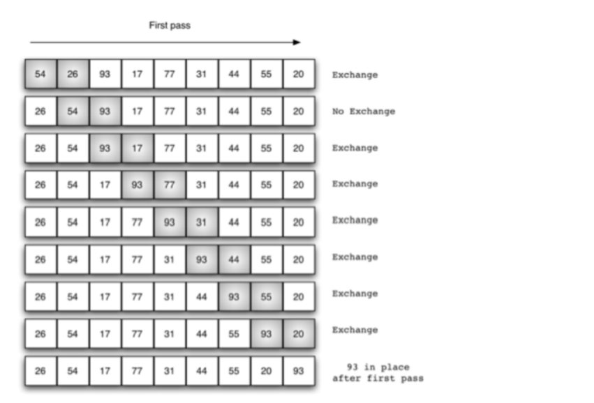
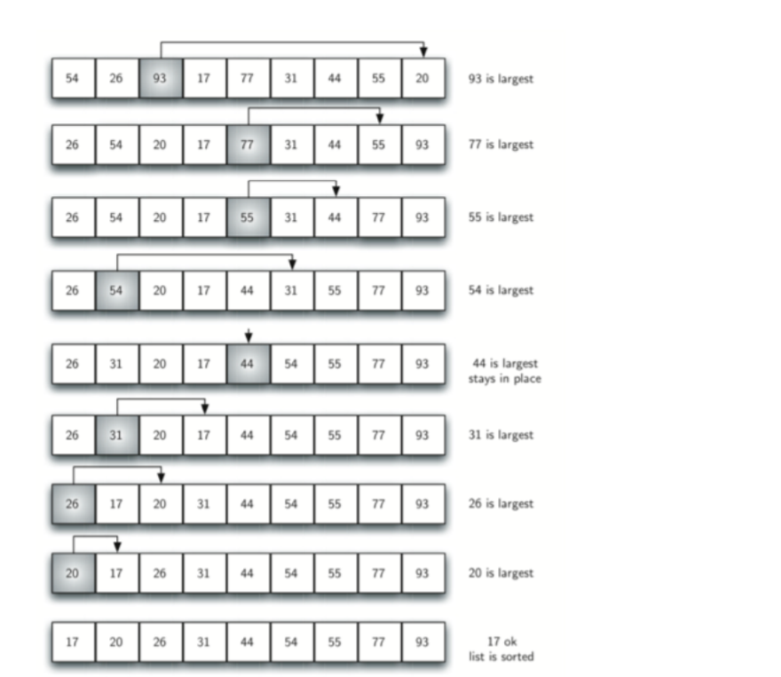
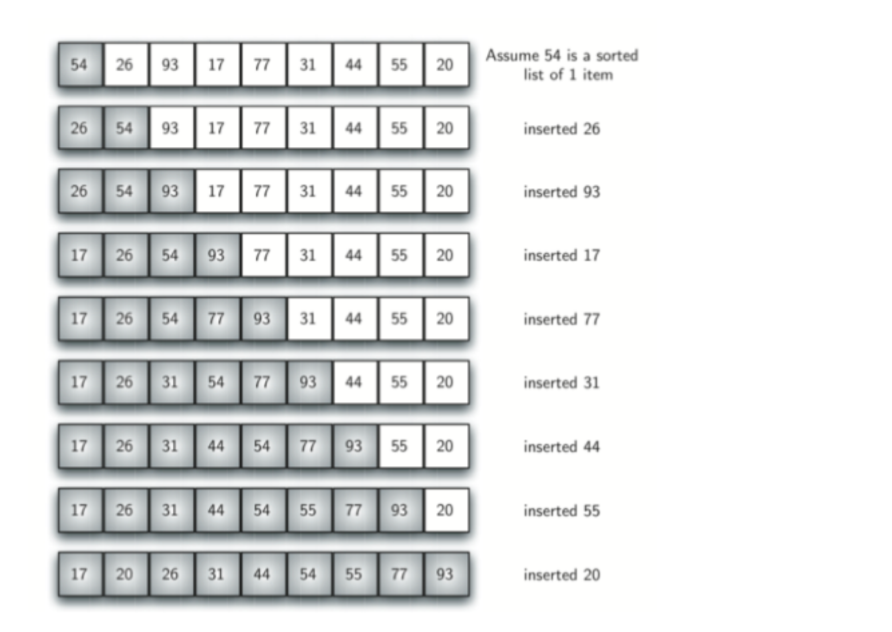
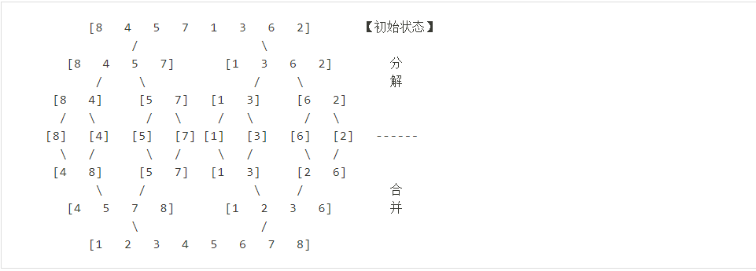

# 常见排序算法

经典排序算法在⾯试中占有很⼤的⽐重，也是基础，在这⾥整理并⽤Java实现了⼏⼤经典排序算
法，包括冒泡排序、插⼊排序、选择排序、希尔排序、归并排序、快速排序、堆排序、同排序。
我们默认将⼀个⽆序数列排序成由⼩到⼤。

## 一、冒泡排序（Bubble Sort）

### 1.1 基本思想

冒泡排序(bubble sort)：每个回合都从第⼀个元素开始和它后⾯的元素⽐较，如果⽐它后⾯的元
素更⼤的话就交换，⼀直重复，直到这个元素到了它能到达的位置。每次遍历都将剩下的元素中
最⼤的那个放到了序列的“最后”(除去了前⾯已经排好的那些元素)。

> 简单的优化：检测是否已经完成了排序，如果已完成就可以退出了。

### 1.2 代码

未优化代码：

~~~java
public class Demo{
    public static void main(String[] args) {
        int[] arr = {10, 30, 20, 60, 40, 50};
        bubbleSort(arr);

        for(int i : arr){
            System.out.println(i);
        }
    }

    public static void bubbleSort(int[] arr){
        int tmp = 0;

        for(int i = arr.length - 1; i > 0; --i){     //表示待排序数组的长度
            for(int j = 0; j < i; ++j){           //从前i个元素中找最大元素
                if(arr[j] > arr[j + 1]){
                    tmp = arr[j];
                    arr[j] = arr[j + 1];
                    arr[j + 1] = tmp;
                }
            }
        }
    }
}
~~~

优化代码：

~~~java
public class Demo{
    public static void main(String[] args) {
        int[] arr = {10, 30, 20, 60, 40, 50};
        bubbleSort(arr);

        for(int i : arr){
            System.out.println(i);
        }
    }

    public static void bubbleSort(int[] arr){
        int tmp = 0;
        boolean flag = true;

        for(int i = arr.length - 1; i > 0; --i){     //表示待排序数组的长度
            flag = true;

            for(int j = 0; j < i; ++j){           //从前i个元素中找最大元素
                if(arr[j] > arr[j + 1]){
                    tmp = arr[j];
                    arr[j] = arr[j + 1];
                    arr[j + 1] = tmp;
                    flag = false;
                }
            }

            //如果没有交换，则排序结束，跳出循环
            if(flag){
                break;
            }
        }
    }
}
~~~

### 1.3 时空复杂度

冒泡排序的关键字⽐较次数与数据元素的初始状态⽆关。第⼀趟的⽐较次数为 n-1，第i趟的⽐较
次数为 n-i，第 n-1 趟（最后⼀趟）的⽐较次数为1，因此冒泡排序总的⽐较次数为 n(n - 1) / 2。

冒泡排序的数据元素移动次数与序列的初始状态有关。在最好的情况下，移动次数为 0 次；在最
坏的情况下，移动次数为 n(n - 1) / 2。

冒泡排序的时间复杂度为 $O(n^2)$。冒泡排序不需要辅助存储单元，其空间复杂度为$O(1)$ 。如果关
键字相等，则冒泡排序不交换数据元素，他是⼀种稳定的排序⽅法。

> 时间复杂度：最好$O(n)$；最坏$O(n^2)$；平均$O(n^2)$
>
> 空间复杂度：$O(1)$
>
> 稳定性：稳定

## 二、选择排序（Selection Sort）

### 2.1 思想

每个回合都选择出剩下的元素中最⼤的那个，选择的⽅法是⾸先默认第⼀元素是最⼤的，如果后
⾯的元素⽐它⼤的话，那就更新剩下的最⼤的元素值，找到剩下元素中最⼤的之后将它放⼊到合
适的位置就⾏了。和冒泡排序类似，只是找剩下的元素中最⼤的⽅式不同⽽已。

### 2.2 实现方法

每次找出最小的或者最大的都可以。以下为每次找出最小的代码：

~~~java
public static void selectionSort(int[] arr){
    int tmp, min;

    for(int i = 0; i < arr.length - 1; ++i){
        min = i;

        //每次循环找出最小值
        for(int j = i + 1; j < arr.length; ++j){
            if(arr[min] > arr[j]){
                min = j;
            }
        }

        //交换
        if(min != i){
            tmp = arr[min];
            arr[min] = arr[i];
            arr[i] = tmp;
        }
    }
}
~~~

### 2.3 时空复杂度

对具有 n 个数据元素的序列进⾏排序时，选择排序需要进⾏ n-1 趟选择。进⾏第 i 趟选择时，后⾯已经有 i-1 个数据元素排好序，第 i 趟从剩下的 n-i+1 个数据元素中选择⼀个关键字最⼤的数据元素，并将它与倒数第 n-i 个数据元素交换，这样即可使后⾯的 个数据元素排好序。

选择排序的关键字⽐较次数与序列的初始状态⽆关。对 n 个数据元素进⾏排序时，第⼀趟的⽐较次数为 n-1，第 i 趟的⽐较次数是 n-i 次，第 n-1 趟（最后⼀趟）的⽐较次数是1次。因此，总的⽐较次数为 n(n-1)/2.

选择排序每⼀趟都可能移动⼀次数据元素，其总的移动次数与序列的初始状态有关。当序列已经排好序时，元素的移动次数为 0。当每⼀趟都需要移动数据元素时，总的移动次数为 n-1。

选择排序的时间复杂度为$O(n^ 2 )$ 。选择排序不需要辅助的存储单元，其空间复杂度为$O(1 )$ 。选择排序在排序过程中需要在不相邻的数据元素之间进⾏交换，它是⼀种不稳定的排序⽅法。

> 时间复杂度：$O(n^2)$
>
> 空间复杂度：$O(1)$
>
> 稳定性：不稳定

## 三、插入排序（Insertion Sort）

### 3.1 基本思想

对具有 n 个数据元素的序列进⾏排序时，插⼊排序需要进⾏ n-1 趟插⼊。进⾏第 $j (1 \leq j \leq n-1)$
趟插⼊时，前⾯已经有 j 个元素排好序了，第 j 趟将 a[j+1] 插⼊到已经排好序的序列中，这样即可使前⾯的 j+1个数据排好序。

### 3.2 代码

~~~java
public static void insertionSort(int[] arr){
    int tmp, j;

    for(int i = 1; i < arr.length; ++i){
        tmp = arr[i];
        j = i;

        while(j > 0 && arr[j - 1] > tmp){
            arr[j] = arr[j - 1];
            --j;
        }
        arr[j] = tmp;
    }
}
~~~

### 3.3 时空复杂度

直接插⼊排序关键字⽐较次数和数据元素移动次数与数据元素的初始状态有关。在最好的情况下，待排序的序列是已经排好序的，每⼀趟插⼊，只需要⽐较⼀次就可以确定待插⼊的数据元素的位置，需要移动两次数据元素。因此总的关键字⽐较次数为 n-1,总的数据元素移动次数为 2(n - 1)。

在最坏的情况下，待排序的序列是反序的，每⼀趟中，待插⼊的数据元素需要与前⾯已排序序列的每⼀个数据元素进⾏⽐较，移动次数等于⽐较次数。因此，总的⽐较次数和移动次数都是 n(n - 1)/2。

直接插⼊排序的时间复杂度为 $O(n^2)$。直接插⼊排序需要⼀个单元的辅助存储单元，空间复杂度为$O(1)$。直接插⼊排序只在相邻的数据元素之间进⾏交换，它是⼀种稳定的排序⽅法。

> 最好情况$O(n)$，最坏情况$O(n^2 )$，平均时间复杂度为$O(n^2 )$。
>
> 空间复杂度：$O(1)$
>
> 稳定性：稳定

## 四、希尔排序

## 五、归并排序

### 5.1 基本思想

归并排序是典型的二路合并排序，首先将原始的数据分为两部分，分别对这两部分数据进行归并排序，然后再将排序好后的两个子数据集进行合并。并且归并排序是稳定的排序。

### 5.2 实现代码

~~~java
import java.util.*;

public class Main{
    private static int[] tmp = null;
    public static void main(String[] args) {
        int[] arr = {10, 30, 20, 60, 40, 50};
        tmp = new int[arr.length];
        MergeSort(arr, 0, arr.length - 1);

        for(int i : arr){
            System.out.println(i);
        }
    }

    //首先将待排序的数组拆分，在合并
    public static void MergeSort(int[] arr, int s, int e){
        if(s < e){
            int mid = s + (e - s)/2;       //避免溢出
            MergeSort(arr, s, mid);
            MergeSort(arr, mid + 1, e);
            Merge(arr, s, mid, e);
        }

        return;
    }

    //合并两个有序数组
    public static void Merge(int[] arr, int s, int mid, int e){
        int first = s;
        int second = mid + 1;
        int index = 0;

        while (first <= mid && second <= e){
            if(arr[first] <= arr[second]){
                tmp[index++] = arr[first++];
            } else {
                tmp[index++] = arr[second++];
            }
        }

        while(first <= mid){
            tmp[index++] = arr[first++];
        }
        while(second <= e){
            tmp[index++]= arr[second++];
        }

        for(int k = s; k <= e; ++k){
            arr[k] = tmp[k - s];
        }
    }
}
~~~

### 5.3 时空复杂度

在归并排序中，进⾏⼀趟归并需要的关键字⽐较次数和数据元素移动次数最多为 n，需要归并的趟数为 $log_2n$ ，故归并排序的时间复杂度为 $O(nlog_2n)$ 。归并排序需要长度等于序列⻓度为 n 的辅助存储单元，故归并排序的空间复杂度为 O(n)。归并排序是稳定的排序算法。

> 时间复杂度：$O(nlog_2n)$
>
> 空间复杂度：O(n)
>
> 稳定性：稳定

## 六、快速排序

## 七、堆排序

## 八、计数排序

## 九、桶排序

### 9.1 基本思想

桶排序是计数排序的升级版，同样用到了桶的概念，通过指定的映射函数，将数组中的元素装入到指定的桶中，而算法的效率也主要取决于映射函数的选取，一般考虑以下两个方面：

* 空间充足的情况下，设置更多的桶
* 元素尽量均衡的分布在桶中

示意图：

元素分布在桶中：

排序之后：

### 9.2 代码实现

步骤：

* 查找出带排序数组中的最大值和最小值
* 计算出需要多少个桶
* 将待排元素按照指定的映射函数装入指定的桶中
* 对每一个桶分别进行排序，可以采用插入、选择等排序方法。同时将数组进行合并。

~~~java
import java.util.Arrays;

public class Demo{
    public static void main(String[] args) {
        int[] arr = {10, 30, 20, 60, 40, 50};
        bucketSort(arr, 1);

        for(int i : arr){
            System.out.println(i);
        }
    }

    public static void bucketSort(int[] arr, int bucketSize){
        //判空
        if(arr == null || arr.length == 0 || bucketSize <= 0){
            return;
        }

        int len = arr.length;
        int min = arr[0];
        int max = arr[0];

        //查找数组中的最大值和最小值
        for(int i = 0; i < len; ++i){
            if(arr[i] > max){
                max = arr[i];
            }
            if(arr[i] < min){
                min = arr[i];
            }
        }

        //计算有多少个桶
        /**
         * (max - min + 1)：表示从最小值到最大值元素的个数
         * +1：因为可能有零头，所以需要多加一个桶
         */
        int bucketCount = (max - min + 1) / bucketSize + 1;
        int[][] buckets = new int[bucketCount][0];
        
        //将元素装入桶中
        for(int value : arr){
            int index = (value - min) / bucketSize;
            buckets[index] = arrayAppend(buckets[index], value);
        }

        //作为合并时 arr 的下标
        int tag = 0;

        //将所有桶中的元素合并，在这之前首先
        for(int i = 0; i < buckets.length; ++i){
            if(buckets[i].length <= 0){
                continue;
            }

            //对桶进行插入排序
            insertionSort(buckets[i]);

            for(int value : buckets[i]){
                arr[tag++] = value;
            }
        }
    }

    //将指定的元素插入相对应的桶中，当然也可以直接使用 List 代替该操作
    public static int[] arrayAppend(int[] buckets, int value){
        int[] arr = Arrays.copyOf(buckets, buckets.length + 1);
        arr[arr.length - 1] = value;
        return arr;
    }

    //插入排序算法
    public static void insertionSort(int[] arr){
        int tmp, j;
    
        for(int i = 1; i < arr.length; ++i){
            tmp = arr[i];
            j = i;
    
            while(j > 0 && arr[j - 1] > tmp){
                arr[j] = arr[j - 1];
                --j;
            }
            arr[j] = tmp;
        }
    }
}
~~~

### 9.3 时空复杂度

参照《算法导论》中的证明，只要输入的数据满足所有的桶的大小的平方和与总的元素数呈线性关系，则桶排序便可以在线性时间内完成。空间复杂度为桶的个数加上元素的个数。

> 时间复杂度：O(n)
>
> 空间复杂度：O(m + n)，其中 m 为桶的个数，n 为元素的个数
>
> 稳定性：稳定

## 十、基数排序

