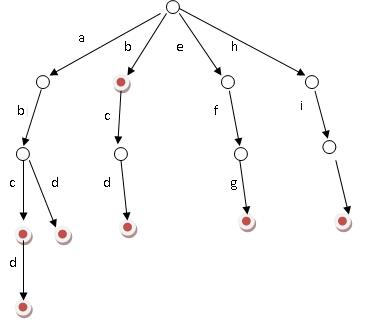

# Trie 树

## 一、介绍

又称**单词查找树**，**字典树**，是一种树形结构，是一种哈希树的变种。典型应用是用于统计，排序和保存大量的字符串（但不仅限于字符串），所以经常被搜索引擎系统用于文本词频统计。它的优点是：利用字符串的公共前缀来节约存储空间，最大限度地减少无谓的字符串比较，查询效率比哈希表高。 

Trie 树的核心思想是空间换时间。利用字符串的公共前缀来降低查询时间的开销以达到提高效率的目的。

基本性质：

- 根节点不包含字符，除根节点外每一个节点都只包含一个字符。

- 从根节点到某一节点，路径上经过的字符连接起来，为该节点对应的字符串。

- 每个节点的所有子节点包含的字符都不相同。

通常在实现的时候，会在节点结构中设置⼀个**标志**，⽤来标记该结点处是否构成⼀个单词（关键字）。可以看出，Trie 树的关键字⼀般都是字符串，⽽且Trie树把每个关键字保存在⼀条路径上，⽽不是⼀个结点中。另外，两个有公共前缀的关键字，在 Trie 树中前缀部分的路径相同，所以 Trie 树⼜叫做前缀树（Prefix Tree）。结构如下图所示：

## 二、Trie 树的优缺点：

### 2.1 优点

Trie 的强大之处就在于它的时间复杂度，插⼊和查询的效率很高，都为 O(K)，其中 K 是待插⼊/查询的字符串长度，而与Trie中保存了多少个元素⽆关。关于查询，会有⼈说 hash 表时间复杂度是不是更快？但是，哈希搜索的效率通常取决于 hash 函数的好坏，若⼀个坏的 hash 函数导致很多的冲突，效率并不⼀定⽐Trie树⾼。而Trie树中不同的关键字就不会产⽣冲突。它只有在允许⼀个关键字关联多个值的情况下才有类似 hash 碰撞发⽣。此外，Trie树不⽤求 hash 值，对短字符串有更快的速度。因为通常，求hash值也是需要遍历字符串的。Trie树可以对关键字按字典序排序。

### 2.2 缺点

当哈希函数比较好的时候，哈希表的效率会比较高。其次，由于 Trie 是通过空间来换取时间的，因此空间的消耗会较高。

## 三、Trie 树的应用

* 字符串检索
* 词频统计
* 字符串排序
* 前缀匹配
* 最长公共前缀
* ...

## 四、Trie 树的实现

Trie 树的插⼊、删除、查找的操作都是⼀样的，只需要简单的对树进⾏⼀遍遍历即可，时间复杂度：O（n）（n是字符串的长度）。trie 树每⼀层的节点数是 级别的。所以为了节省空间，对于 Trie 树的实现可以使⽤数组和链表
两种方式。空间的花费，不会超过单词数×单词长度。

* 数组：由于我们知道⼀个Tried树节点的⼦节点的数量是固定26个（针对不同情况会不同，比如兼容数字，则是36等），所以可以使⽤固定⻓度的数组来保存节点的子节点

  优点：在对⼦节点进⾏查找时速度快

  缺点：浪费空间，不管⼦节点有多少个，总是需要分配26个空间

* 链表：使⽤链表的话我们需要在每个⼦节点中保存其兄弟节点的链接，当我们在⼀个节点的⼦节点中查找是否存在⼀个字符时，需要先找到其⼦节点，然后顺着⼦节点的链表从左往右进行遍历。

  优点：节省空间，有多少个⼦节点就占⽤多少空间，不会造成空间浪费

  缺点：对⼦节点进⾏查找相对较慢，需要进⾏链表遍历，同时实现也较数组麻烦

> Java 代码实现

~~~java
import java.util.ArrayList;
import java.util.Arrays;
import java.util.List;

public class Trie{
    private Vertex root = new Vertex();     //字典树的根节点

    /**构造方法 */
    public Trie(){

    }

    /**
     * 字典树的结点结构
     */
    private class Vertex{
        int wordCount;      //记录当前结点结尾的单词出现次数
        int prefixCount;     //记录以当前字符串作为前缀的单词个数

        Vertex[] childs = new Vertex[26];

        public Vertex(){
            wordCount = 0;
            prefixCount = 0;
        }
    }

    /**
     * 向根节点添加一个单词
     * @param word
     */
    public void addWord(String word){
        addWord(root, word.toLowerCase(), 0);
    }

    /**
     * 添加单词
     * @param vertex
     * @param word
     * @param level
     */
    private void addWord(Vertex vertex, String word, int level){
        //匹配完毕，记录
        if(word.length() == level){
            vertex.wordCount++;
        } else if(level < word.length()){
            vertex.prefixCount++;
            char c = word.charAt(level);
            int index = c - 'a';
            if(vertex.childs[index] == null){
                vertex.childs[index] = new Vertex();
            }
            addWord(vertex.childs[index], word, level + 1);
        }
    }

    /**
     * 统计某一个单词出现的次数
     * @param word
     * @return
     */
    public int countWord(String word){
        return countWord(root, word, 0);
    }

    /**
     * 统计一个单词出现的次数
     * @param vertex
     * @param word
     * @param level
     * @return 单词出现的次数
     */
    private int countWord(Vertex vertex, String word, int level){
        if(level == word.length()){
            return vertex.wordCount;
        } else {
            char c =word.charAt(level);
            int index = c - 'a';

            if(vertex.childs[index] == null){
                return 0;
            } else {
                return countWord(vertex.childs[index], word, level + 1);
            }
        }
    }

    /**
     * 统计以某一个前缀开始的单词的数目，前缀本身不算
     * @param prefix
     * @return
     */
    public int countPrefix(String prefix){
        return countPrefix(root, prefix, 0);
    }

    /**
     * 统计以某一个前缀开始的单词的数目，前缀本身不算
     * @param vertex
     * @param word
     * @param level
     * @return
     */
    private int countPrefix(Vertex vertex, String prefix, int level){
        if(level == prefix.length()){
            return vertex.prefixCount;
        } else {
            char c = prefix.charAt(level);
            int index = c - 'a';

            if(vertex.childs[index] == null){
                return 0;
            } else {
                return countPrefix(vertex.childs[index], prefix, level + 1);
            }
        }
    }

    /**
     * 统计所有的单词
     * @return
     */
    public List<String> listAllWords(){
        List<String> allWords = new ArrayList<>();
        return depthSearchWords(root, allWords, "");
    }

    /**
     * 统计单词的数目
     * @param vertex
     * @param allWords
     * @param prefix
     * @return
     */
    private List<String> depthSearchWords(Vertex vertex, List<String> allWords, String prefix){
        Vertex[] vertexs = vertex.childs;

        for(int i = 0; i < vertexs.length; ++i){
            if(null != vertexs[i]){
                if(vertexs[i].wordCount > 0){
                    allWords.add(prefix + (char)(i + 'a'));
                    if(vertexs[i].prefixCount > 0){
                        depthSearchWords(vertexs[i], allWords, prefix + (char)(i + 'a'));
                    }
                } else {
                    depthSearchWords(vertexs[i], allWords, prefix + (char)(i + 'a'));
                }
            }
        }

        return allWords;
    }

    public static void main(String[] args) {
        Trie trie =	new	Trie();
        trie.addWord("abc");
        trie.addWord("abcd");
        trie.addWord("abcde");
        trie.addWord("abcdef");
        System.out.println(trie.countPrefix("abc"));
        System.out.println(trie.countWord("abc"));
        System.out.println(trie.listAllWords());
    }
}
~~~

***

**通过循环建树：**

字典树中添加结点的方法：

~~~java
public TrieNode add(char chr){
    if(next[chr-'a'] != null) {
    	return next[chr-'a'];    
    }
        
    next[chr-'a'] = new TrieNode();
    return next[chr-'a'];
}
~~~

程序外部插入单词：

~~~java
for(int i=0;i<words.length;i++){
    TrieNode node = root;
    for(int j=0;j<words[i].length();j++){
        node = node.add(words[i].charAt(j));
    }
    node.word = words[i];
}
~~~

