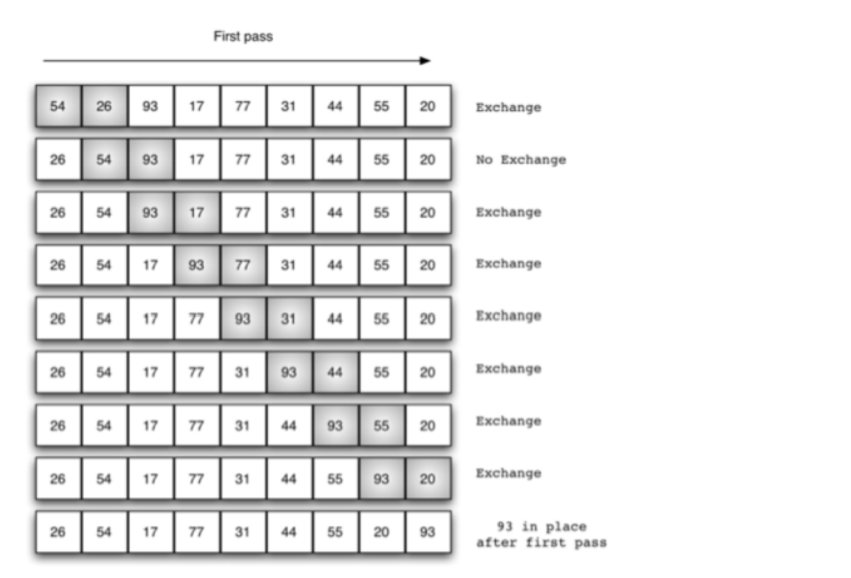

# 常见排序算法

经典排序算法在⾯试中占有很⼤的⽐重，也是基础，在这⾥整理并⽤Java实现了⼏⼤经典排序算
法，包括冒泡排序、插⼊排序、选择排序、希尔排序、归并排序、快速排序、堆排序、同排序。
我们默认将⼀个⽆序数列排序成由⼩到⼤。

## 一、冒泡排序（Bubble Sort）

### 1.1 基本思想

冒泡排序(bubble sort)：每个回合都从第⼀个元素开始和它后⾯的元素⽐较，如果⽐它后⾯的元
素更⼤的话就交换，⼀直重复，直到这个元素到了它能到达的位置。每次遍历都将剩下的元素中
最⼤的那个放到了序列的“最后”(除去了前⾯已经排好的那些元素)。

> 简单的优化：检测是否已经完成了排序，如果已完成就可以退出了。

### 1.2 代码

未优化代码：

~~~java
public class Demo{
    public static void main(String[] args) {
        int[] arr = {10, 30, 20, 60, 40, 50};
        bubbleSort(arr);

        for(int i : arr){
            System.out.println(i);
        }
    }

    public static void bubbleSort(int[] arr){
        int tmp = 0;

        for(int i = arr.length - 1; i > 0; --i){     //表示待排序数组的长度
            for(int j = 0; j < i; ++j){           //从前i个元素中找最大元素
                if(arr[j] > arr[j + 1]){
                    tmp = arr[j];
                    arr[j] = arr[j + 1];
                    arr[j + 1] = tmp;
                }
            }
        }
    }
}
~~~

优化代码：

~~~java
public class Demo{
    public static void main(String[] args) {
        int[] arr = {10, 30, 20, 60, 40, 50};
        bubbleSort(arr);

        for(int i : arr){
            System.out.println(i);
        }
    }

    public static void bubbleSort(int[] arr){
        int tmp = 0;
        boolean flag = true;

        for(int i = arr.length - 1; i > 0; --i){     //表示待排序数组的长度
            flag = true;

            for(int j = 0; j < i; ++j){           //从前i个元素中找最大元素
                if(arr[j] > arr[j + 1]){
                    tmp = arr[j];
                    arr[j] = arr[j + 1];
                    arr[j + 1] = tmp;
                    flag = false;
                }
            }

            //如果没有交换，则排序结束，跳出循环
            if(flag){
                break;
            }
        }
    }
}
~~~

