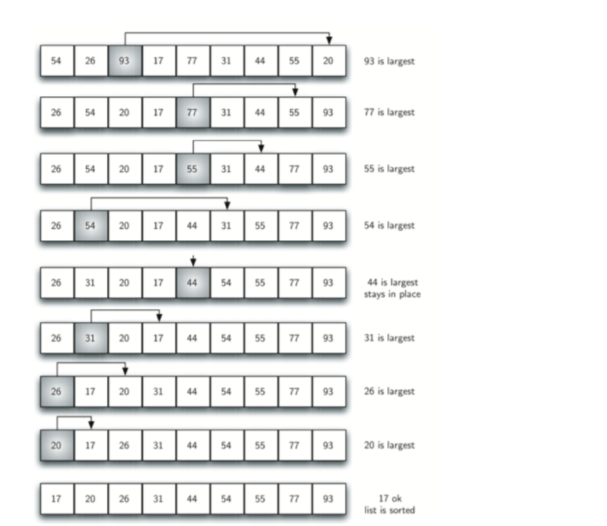
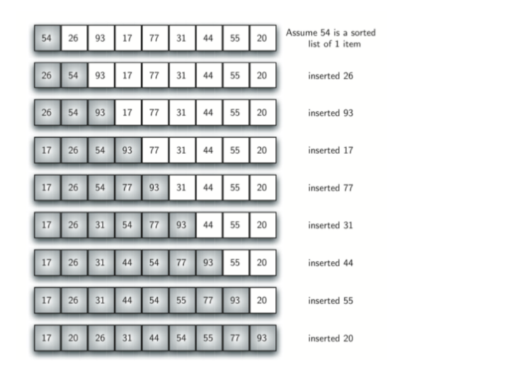

# 常见排序算法

经典排序算法在⾯试中占有很⼤的⽐重，也是基础，在这⾥整理并⽤Java实现了⼏⼤经典排序算
法，包括冒泡排序、插⼊排序、选择排序、希尔排序、归并排序、快速排序、堆排序、同排序。
我们默认将⼀个⽆序数列排序成由⼩到⼤。

## 一、冒泡排序（Bubble Sort）

### 1.1 基本思想

冒泡排序(bubble sort)：每个回合都从第⼀个元素开始和它后⾯的元素⽐较，如果⽐它后⾯的元
素更⼤的话就交换，⼀直重复，直到这个元素到了它能到达的位置。每次遍历都将剩下的元素中
最⼤的那个放到了序列的“最后”(除去了前⾯已经排好的那些元素)。

> 简单的优化：检测是否已经完成了排序，如果已完成就可以退出了。

### 1.2 代码

未优化代码：

~~~java
public class Demo{
    public static void main(String[] args) {
        int[] arr = {10, 30, 20, 60, 40, 50};
        bubbleSort(arr);

        for(int i : arr){
            System.out.println(i);
        }
    }

    public static void bubbleSort(int[] arr){
        int tmp = 0;

        for(int i = arr.length - 1; i > 0; --i){     //表示待排序数组的长度
            for(int j = 0; j < i; ++j){           //从前i个元素中找最大元素
                if(arr[j] > arr[j + 1]){
                    tmp = arr[j];
                    arr[j] = arr[j + 1];
                    arr[j + 1] = tmp;
                }
            }
        }
    }
}
~~~

优化代码：

~~~java
public class Demo{
    public static void main(String[] args) {
        int[] arr = {10, 30, 20, 60, 40, 50};
        bubbleSort(arr);

        for(int i : arr){
            System.out.println(i);
        }
    }

    public static void bubbleSort(int[] arr){
        int tmp = 0;
        boolean flag = true;

        for(int i = arr.length - 1; i > 0; --i){     //表示待排序数组的长度
            flag = true;

            for(int j = 0; j < i; ++j){           //从前i个元素中找最大元素
                if(arr[j] > arr[j + 1]){
                    tmp = arr[j];
                    arr[j] = arr[j + 1];
                    arr[j + 1] = tmp;
                    flag = false;
                }
            }

            //如果没有交换，则排序结束，跳出循环
            if(flag){
                break;
            }
        }
    }
}
~~~

### 1.3 时空复杂度

冒泡排序的关键字⽐较次数与数据元素的初始状态⽆关。第⼀趟的⽐较次数为 n-1，第i趟的⽐较
次数为 n-i，第 n-1 趟（最后⼀趟）的⽐较次数为1，因此冒泡排序总的⽐较次数为 n(n - 1) / 2。

冒泡排序的数据元素移动次数与序列的初始状态有关。在最好的情况下，移动次数为 0 次；在最
坏的情况下，移动次数为 n(n - 1) / 2。

冒泡排序的时间复杂度为 $O(n^2)$。冒泡排序不需要辅助存储单元，其空间复杂度为$O(1)$ 。如果关
键字相等，则冒泡排序不交换数据元素，他是⼀种稳定的排序⽅法。

> 时间复杂度：最好$O(n)$；最坏$O(n^2)$；平均$O(n^2)$
>
> 空间复杂度：$O(1)$
>
> 稳定性：稳定

## 二、选择排序（Selection Sort）

### 2.1 思想

每个回合都选择出剩下的元素中最⼤的那个，选择的⽅法是⾸先默认第⼀元素是最⼤的，如果后
⾯的元素⽐它⼤的话，那就更新剩下的最⼤的元素值，找到剩下元素中最⼤的之后将它放⼊到合
适的位置就⾏了。和冒泡排序类似，只是找剩下的元素中最⼤的⽅式不同⽽已。

### 2.2 实现方法

每次找出最小的或者最大的都可以。以下为每次找出最小的代码：

~~~java
public static void selectionSort(int[] arr){
    int tmp, min;

    for(int i = 0; i < arr.length - 1; ++i){
        min = i;

        //每次循环找出最小值
        for(int j = i + 1; j < arr.length; ++j){
            if(arr[min] > arr[j]){
                min = j;
            }
        }

        //交换
        if(min != i){
            tmp = arr[min];
            arr[min] = arr[i];
            arr[i] = tmp;
        }
    }
}
~~~

### 2.3 时空复杂度

对具有 n 个数据元素的序列进⾏排序时，选择排序需要进⾏ n-1 趟选择。进⾏第 i 趟选择时，后⾯已经有 i-1 个数据元素排好序，第 i 趟从剩下的 n-i+1 个数据元素中选择⼀个关键字最⼤的数据元素，并将它与倒数第 n-i 个数据元素交换，这样即可使后⾯的 个数据元素排好序。

选择排序的关键字⽐较次数与序列的初始状态⽆关。对 n 个数据元素进⾏排序时，第⼀趟的⽐较次数为 n-1，第 i 趟的⽐较次数是 n-i 次，第 n-1 趟（最后⼀趟）的⽐较次数是1次。因此，总的⽐较次数为 n(n-1)/2.

选择排序每⼀趟都可能移动⼀次数据元素，其总的移动次数与序列的初始状态有关。当序列已经排好序时，元素的移动次数为 0。当每⼀趟都需要移动数据元素时，总的移动次数为 n-1。

选择排序的时间复杂度为$O(n^ 2 )$ 。选择排序不需要辅助的存储单元，其空间复杂度为$O(1 )$ 。选择排序在排序过程中需要在不相邻的数据元素之间进⾏交换，它是⼀种不稳定的排序⽅法。

> 时间复杂度：$O(n^2)$
>
> 空间复杂度：$O(1)$
>
> 稳定性：不稳定

## 三、插入排序（Insertion Sort）

### 3.1 基本思想

对具有 n 个数据元素的序列进⾏排序时，插⼊排序需要进⾏ n-1 趟插⼊。进⾏第 $j (1 \leq j \leq n-1)$
趟插⼊时，前⾯已经有 j 个元素排好序了，第 j 趟将 a[j+1] 插⼊到已经排好序的序列中，这样即可使前⾯的 j+1个数据排好序。

### 3.2 代码

~~~java
public static void insertionSort(int[] arr){
    int tmp, j;

    for(int i = 1; i < arr.length; ++i){
        tmp = arr[i];
        j = i;

        while(j > 0 && arr[j - 1] > tmp){
            arr[j] = arr[j - 1];
            --j;
        }
        arr[j] = tmp;
    }
}
~~~

### 3.3 时空复杂度

直接插⼊排序关键字⽐较次数和数据元素移动次数与数据元素的初始状态有关。在最好的情况下，待排序的序列是已经排好序的，每⼀趟插⼊，只需要⽐较⼀次就可以确定待插⼊的数据元素的位置，需要移动两次数据元素。因此总的关键字⽐较次数为 n-1,总的数据元素移动次数为 2(n - 1)。

在最坏的情况下，待排序的序列是反序的，每⼀趟中，待插⼊的数据元素需要与前⾯已排序序列的每⼀个数据元素进⾏⽐较，移动次数等于⽐较次数。因此，总的⽐较次数和移动次数都是 n(n - 1)/2。

直接插⼊排序的时间复杂度为 $O(n^2)$。直接插⼊排序需要⼀个单元的辅助存储单元，空间复杂度为$O(1)$。直接插⼊排序只在相邻的数据元素之间进⾏交换，它是⼀种稳定的排序⽅法。

> 最好情况$O(n)$，最坏情况$O(n^2 )$，平均时间复杂度为$O(n^2 )$。
>
> 空间复杂度：$O(1)$
>
> 稳定性：稳定

